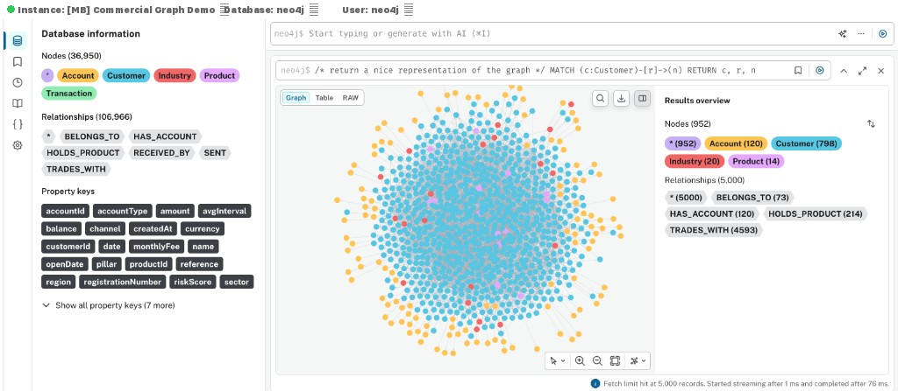

# Commercial Graph — Neo4j Aura Demo

A complete demo environment for the **Commercial Graph** Proof of Value, demonstrating how Neo4j property graphs solve commercial ecosystem analysis, unbanked client identification, entity resolution, payment behaviour insights, and credit decisioning.

> **Dashboard**: A full Next.js dashboard is available at [mbabari/commercial-bank-graph-dashboard](https://github.com/mbabari/commercial-bank-graph-dashboard) — live at [commercial-graph-dashboard.vercel.app](https://commercial-graph-dashboard.vercel.app)

## Graph After Data Ingestion



## What's Included

| Deliverable | Location | Description |
|---|---|---|
| Data Model | `data-model/model.md` | Property graph model with Mermaid diagram |
| Synthetic Data | `data/` | 10 CSV files (~36,000 transactions, 800 entities, 40 planted ER pairs — 15 use legal-name variants scored ≥ ~0.70) |
| Schema & Load | `cypher/01_schema.cypher`, `cypher/02_load_data.cypher` | Constraints, indexes, and LOAD CSV import |
| Business Queries | `cypher/03_queries.cypher` | 13 Cypher queries across 5 user stories |
| GDS Algorithms | `cypher/04_gds_algorithms.cypher` | PageRank, Louvain, Betweenness, Node Similarity |
| Entity Resolution | `cypher/06_entity_resolution.cypher` | Multi-signal ER pipeline (name, industry, region, graph structure) |
| Explore Story | `explore/explore_story.md` | 7-scene walkthrough for a sales analyst persona |

## Quick Start

### 1. Provision a Neo4j Aura Instance

- Go to [Neo4j Aura](https://console.neo4j.io/) and create a new instance.
- Choose **AuraDB Professional** or **Enterprise** (GDS requires Professional+).
- Note your connection URI, username, and password.

### 2. Host the CSV Files

The CSV files need to be accessible via HTTPS for `LOAD CSV`. Options:

**Option A — GitHub (recommended for demo):**
Push this repo to GitHub and use raw file URLs:
```
https://raw.githubusercontent.com/<org>/<repo>/main/data/industries.csv
```

**Option B — Local Neo4j (Desktop):**
Copy the `data/` folder contents into your Neo4j `import/` directory and use `file:///` URLs in the load script.

### 3. Run the Scripts in Order

Open the **Neo4j Query UI** (Browser or Aura Query) and execute:

```
1. cypher/01_schema.cypher              — creates constraints, indexes, and fulltext index
2. cypher/02_load_data.cypher           — loads all CSV data and creates TRADES_WITH edges
3. cypher/03_queries.cypher             — run individual queries to explore the data
4. cypher/04_gds_algorithms.cypher      — runs GDS and writes properties back to nodes
5. cypher/06_entity_resolution.cypher   — runs multi-signal entity resolution pipeline
```

Before running `02_load_data.cypher`, replace `$BASE_URL` with the actual URL prefix where your CSVs are hosted.

### 4. Explore UI Demo

Open the **Explore** view in Neo4j Aura and follow the step-by-step narrative in `explore/explore_story.md`.

## Data Summary

| Dataset | File | Rows |
|---|---|---|
| Industries (SIC codes) | `industries.csv` | 20 |
| Products (lend/transact/invest/insure) | `products.csv` | 14 |
| Banked Customers | `customers_banked.csv` | 500 |
| Unbanked Entities | `entities_unbanked.csv` | 300 |
| Accounts | `accounts.csv` | ~1,100 |
| EFT Transactions | `transactions_eft.csv` | 15,000 |
| NAV Transactions | `transactions_nav.csv` | 10,000 |
| SOF Transactions | `transactions_sof.csv` | 8,000 |
| SWIFT Transactions | `transactions_swift.csv` | 2,000 |
| Product Holdings | `product_holdings.csv` | ~1,475 |
| ER Ground Truth | `er_ground_truth.csv` | 40 |

All data is synthetic. The unbanked dataset includes 40 planted near-duplicate entities for entity resolution: the first 15 use legal-name suffix variants (for example `… (Pty) Ltd`) with the same region and industry as the banked source so composite confidence exceeds the 0.70 demo threshold after running `06_entity_resolution.cypher`; the remainder use fuzzier variants for manual-review scenarios. Business names, amounts, and identifiers are randomly generated and do not represent real entities.

## Business Questions Answered


1. **Payment Behaviour** — Frequency, volume, and regularity of client payment flows
2. **Unbanked Identification** — Non-banked entities receiving significant payment volume (conversion targets)
3. **Entity Resolution** — Multi-signal matching of unbanked entities to existing banked customers using name similarity, industry/region attributes, and graph-structural trading pattern overlap
4. **Ecosystem Mapping** — Multi-hop traversal of the customer trading network
5. **Product Cross-Sell** — Peer-based product gap analysis by industry
6. **Credit / Collateral Scoring** — Payment diversity, stability, and concentration as creditworthiness proxies

## GDS Algorithms

| Algorithm | Purpose | Written Property |
|---|---|---|
| PageRank | Most influential entities in the payment network | `pageRank` on Customer |
| Louvain | Community/cluster detection (industry ecosystems) | `communityId` on Customer |
| Betweenness Centrality | Broker entities bridging communities | `betweenness` on Customer |
| Node Similarity | Customers with similar trading patterns | `SIMILAR_TO` relationship |

## Entity Resolution

The ER pipeline in `cypher/06_entity_resolution.cypher` identifies unbanked entities that are likely the same real-world company as an existing banked customer. It uses four weighted signals:

| Signal | Weight | Method |
|---|---|---|
| Name Similarity | 0.40 | Jaro-Winkler distance on business names |
| Industry Match | 0.20 | Binary: same SIC code |
| Region Match | 0.15 | Binary: same province |
| Trading Overlap | 0.25 | Jaccard similarity on TRADES_WITH neighbour sets |

Matches above 0.45 confidence are written as `POTENTIAL_MATCH` relationships. The ground truth file `data/er_ground_truth.csv` lists the 40 planted near-duplicate pairs for validation (rows 1–15 align with the high-confidence naming tier in `generate_data.py`).

## Regenerating Data

To regenerate the synthetic CSV files with different parameters:

```bash
python3 generate_data.py
```

Edit the constants at the top of the script (`NUM_BANKED`, `NUM_UNBANKED`, `NUM_EFT`, etc.) to adjust data volume.

## Project Structure

```
commercial-graph-demo/
  README.md                       <- you are here
  generate_data.py                <- synthetic data generator
  data-model/
    model.md                      <- graph data model + Mermaid diagram
  data/
    industries.csv
    products.csv
    customers_banked.csv
    entities_unbanked.csv
    accounts.csv
    transactions_eft.csv
    transactions_nav.csv
    transactions_sof.csv
    transactions_swift.csv
    product_holdings.csv
  cypher/
    01_schema.cypher              <- constraints & indexes
    02_load_data.cypher           <- LOAD CSV import script
    03_queries.cypher             <- business queries (Query UI)
    04_gds_algorithms.cypher      <- GDS projections & algorithms
    05_demo_bookmarks.cypher      <- pre-built demo bookmarks
    06_entity_resolution.cypher   <- multi-signal entity resolution pipeline
  explore/
    explore_story.md              <- Explore UI walkthrough narrative
```
