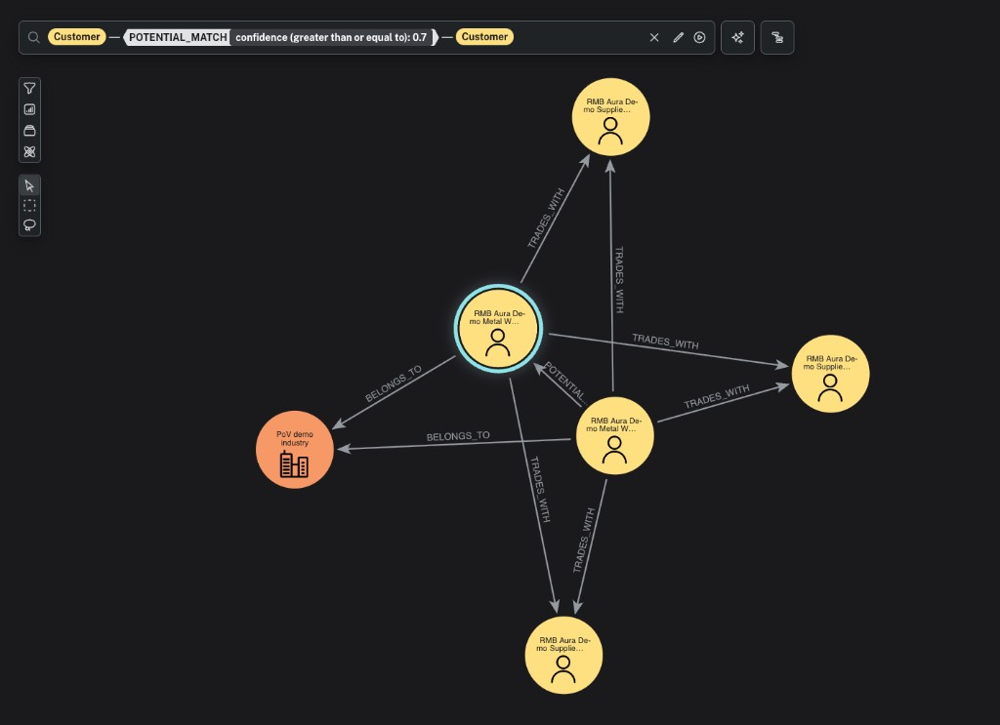

# Neo4j Bloom / Explore — Perspectives & Scenes Setup

## How to Access

1. Go to https://console.neo4j.io
2. Open your ** Commercial Bank Graph Demo** Neo4j instance
3. Click **Explore** (top nav, next to Query)

---

## Part 1 — Perspective Configuration

### Open the Perspective Editor

1. Click the **gear icon** (⚙) in the bottom-left of the Explore canvas
2. Select **Edit Perspective** (or create a new one named **"Commercial Bank Graph"**)

### 1.1 — Node Category Styling

Configure these in **Categories** tab:

#### Customer
- **Caption:** `name`
- **Secondary caption:** `status`
- **Color rule:**
  - `status = "banked"` → **#009639** (brand green (#009639))
  - `status = "unbanked"` → **#F59E0B** (amber/orange)
- **Size rule:** Set to property `turnover` (or `pageRank` if GDS has been run)
- **Icon:** Person

#### Account
- **Caption:** `accountId`
- **Secondary caption:** `accountType`
- **Color:** **#0EA5E9** (sky blue)
- **Icon:** Credit Card

#### Transaction
- **Caption:** `transactionId`
- **Secondary caption:** `channel`
- **Color rule:**
  - `channel = "EFT"` → **#009639** (green)
  - `channel = "NAV"` → **#0EA5E9** (blue)
  - `channel = "SOF"` → **#F59E0B** (amber)
  - `channel = "SWIFT"` → **#8B5CF6** (purple)
- **Size rule:** Set to property `amount`
- **Icon:** Arrow Right Left

#### Industry
- **Caption:** `name`
- **Secondary caption:** `sector`
- **Color:** **#6366F1** (indigo)
- **Icon:** Building

#### Product
- **Caption:** `name`
- **Secondary caption:** `pillar`
- **Color rule:**
  - `pillar = "lend"` → **#009639** (green)
  - `pillar = "transact"` → **#0EA5E9** (blue)
  - `pillar = "invest"` → **#F59E0B** (amber)
  - `pillar = "insure"` → **#8B5CF6** (purple)
- **Icon:** Package

### 1.2 — Relationship Styling

Configure in **Relationship Mappings** tab:

| Relationship | Caption | Thickness | Color |
|-------------|---------|-----------|-------|
| TRADES_WITH | `txCount` | by `amount` | #94A3B8 (slate) |
| HAS_ACCOUNT | — | thin (default) | #CBD5E1 |
| BELONGS_TO | — | thin (default) | #CBD5E1 |
| HOLDS_PRODUCT | `since` | thin (default) | #CBD5E1 |
| SENT | — | thin (default) | #CBD5E1 |
| RECEIVED_BY | — | thin (default) | #CBD5E1 |

### 1.3 — Search Phrases

Add these custom **Search Phrases** in the perspective editor. Each becomes a reusable search in Explore.

#### Search Phrase 1: "Show customer"
```
MATCH (c:Customer)
WHERE c.name CONTAINS $name OR c.customerId = $name
RETURN c LIMIT 10
```
Parameters: `name` (string)

#### Search Phrase 2: "Trading partners of"
```
MATCH (c:Customer)-[tw:TRADES_WITH]-(partner:Customer)
WHERE c.name CONTAINS $customer OR c.customerId = $customer
RETURN c, tw, partner
```
Parameters: `customer` (string)

#### Search Phrase 3: "Unbanked targets"
```
MATCH (banked:Customer {status: 'banked'})-[tw:TRADES_WITH]->(unbanked:Customer {status: 'unbanked'})
WITH unbanked, sum(tw.amount) AS totalInbound
ORDER BY totalInbound DESC LIMIT $limit
WITH collect(unbanked) AS targets
UNWIND targets AS t
MATCH (payer:Customer {status: 'banked'})-[tw:TRADES_WITH]->(t)
RETURN payer, tw, t
```
Parameters: `limit` (integer, default 5)

#### Search Phrase 4: "Ecosystem of"
```
MATCH path = (c:Customer)-[:TRADES_WITH*1..2]-(other:Customer)
WHERE c.name CONTAINS $customer OR c.customerId = $customer
RETURN path LIMIT 150
```
Parameters: `customer` (string)

#### Search Phrase 5: "Products for"
```
MATCH (c:Customer)-[:HOLDS_PRODUCT]->(p:Product)
WHERE c.name CONTAINS $customer OR c.customerId = $customer
RETURN c, p
```
Parameters: `customer` (string)

#### Search Phrase 6: "Industry network"
```
MATCH (c:Customer)-[:BELONGS_TO]->(i:Industry {sector: $sector})
MATCH (c)-[tw:TRADES_WITH]-(partner:Customer)
RETURN c, tw, partner, i LIMIT 100
```
Parameters: `sector` (string, e.g. "Manufacturing")

#### Search Phrase 7: "Customer deep dive"
```
MATCH (c:Customer)
WHERE c.name CONTAINS $customer OR c.customerId = $customer
OPTIONAL MATCH (c)-[:BELONGS_TO]->(i:Industry)
OPTIONAL MATCH (c)-[:HOLDS_PRODUCT]->(p:Product)
OPTIONAL MATCH (c)-[tw:TRADES_WITH]-(partner:Customer)
RETURN c, i, p, tw, partner LIMIT 50
```
Parameters: `customer` (string)

**Save the perspective** after adding all categories, styles, and search phrases.

---

## Part 2 — Scenes

After configuring the perspective, create each scene below. For each scene:
1. Run the specified query/search phrase
2. Arrange the layout as described
3. Click **Save Scene** (camera icon 📷) and name it

---

### Scene 1 — "The Commercial Ecosystem at a Glance"

**Purpose:** Wow the audience with the scale of the graph.

**Query (paste into Explore search bar → Cypher mode):**
```cypher
MATCH (c:Customer {status: 'banked'})-[tw:TRADES_WITH]-(other:Customer)
WITH c, other, tw
WHERE tw.amount > 50000000
RETURN c, tw, other LIMIT 200
```

**Layout:** Force-directed (default). Let it settle.

**What you see:** A dense network of green (banked) and orange (unbanked) nodes connected by trading relationships. Thick edges = high-volume trading pairs.

**Talking point:** *"This is the commercial payment ecosystem. 800 entities, 35,000 transactions. Every line is a real trading relationship."*

---

### Scene 2 — "Payment Behaviour: Who Trades With Whom"

**Purpose:** Show payment frequency and regularity between top trading pairs.

**Query:**
```cypher
MATCH (s:Customer)-[tw:TRADES_WITH]->(r:Customer)
WHERE tw.txCount > 30
RETURN s, tw, r
```

**Layout:** Force-directed. Size nodes by `turnover`.

**What you see:** The most active trading pairs — thick lines connecting frequent traders.

**Talking point:** *"These are the customer pairs with 30+ transactions. The thickness shows volume. We can see regularity in the avgInterval property — this pair trades every 3 days on average."*

**Interaction:** Click a TRADES_WITH edge to show `txCount`, `amount`, `avgInterval` in the detail panel.

---

### Scene 3 — "Unbanked Gold: Conversion Targets"

**Purpose:** Highlight unbanked entities receiving payments from multiple banked customers.

**Query:**
```cypher
MATCH (banked:Customer {status: 'banked'})-[tw:TRADES_WITH]->(unbanked:Customer {status: 'unbanked'})
WITH unbanked, collect(banked) AS payers, sum(tw.amount) AS total
WHERE size(payers) >= 4
UNWIND payers AS payer
MATCH (payer)-[tw2:TRADES_WITH]->(unbanked)
RETURN payer, tw2, unbanked
```

**Layout:** Force-directed. The unbanked nodes will naturally cluster in the center with banked payers around them.

**What you see:** Orange nodes (unbanked) surrounded by green nodes (banked). Each orange node is being paid by 4+ banked customers.

**Talking point:** *"Every orange node here is an unbanked entity receiving significant payments from 4 or more of our customers. These aren't cold leads — they're warm targets already embedded in our customer ecosystem."*

**Interaction:** Click an orange node → inspect its properties → right-click → Expand → BELONGS_TO to see its industry.

---

### Scene 4 — "Customer Ecosystem Deep Dive"

**Purpose:** Explore one customer's full trading network.

**Search Phrase:** Use "Ecosystem of" → type a customer name

**Or use this query:**
```cypher
MATCH path = (c:Customer {customerId: 'CUST-00001'})-[:TRADES_WITH*1..2]-(other:Customer)
RETURN path LIMIT 150
```

**Layout:** Force-directed. The center customer will be surrounded by 1st-hop partners, and 2nd-hop connections form the outer ring.

**What you see:** The customer at the center, with their direct trading partners around them, and the extended ecosystem beyond.

**Talking point:** *"Two hops from this single customer and we can see their entire business world. The green nodes are our customers, the orange ones are not. Each of those orange nodes is a potential new customer."*

**Interaction:**
- Click the center customer → show properties
- Right-click an orange node → Expand → BELONGS_TO (show industry)
- Right-click an orange node → Expand → TRADES_WITH (show its network too)

---

### Scene 5 — "Product Landscape & Cross-Sell"

**Purpose:** Compare products between a customer and their industry peers.

**Query:**
```cypher
MATCH (target:Customer {customerId: 'CUST-00001'})-[:BELONGS_TO]->(i:Industry)<-[:BELONGS_TO]-(peer:Customer)
WHERE peer.status = 'banked' AND peer <> target
WITH target, i, peer ORDER BY rand() LIMIT 4
MATCH (target)-[:HOLDS_PRODUCT]->(tp:Product)
MATCH (peer)-[:HOLDS_PRODUCT]->(pp:Product)
RETURN target, i, peer, tp, pp
```

**Layout:** Hierarchical or force-directed. Manually drag the Industry node to the top, customer nodes in the middle, products at the bottom.

**What you see:** A target customer and 4 industry peers, all connected to their products. Products shared between them are immediately visible (they converge on the same Product node).

**Talking point:** *"Our customer holds 3 products. But look at their peers in the same industry — they also hold Asset Finance and Fleet Insurance. Those are the cross-sell recommendations, backed by peer data."*

**Interaction:** Click product nodes to see pillar, monthly fee. Highlight products the target doesn't hold.

---

### Scene 6 — "Credit Signals: Follow the Money"

**Purpose:** Show how payment diversity translates to creditworthiness.

**Query (Low Risk customer — many diverse payers):**
```cypher
MATCH (payer:Customer)-[tw:TRADES_WITH]->(c:Customer {status: 'banked'})
WITH c, count(DISTINCT payer) AS payers, sum(tw.amount) AS total
WHERE payers >= 10
ORDER BY total DESC LIMIT 1
WITH c
MATCH (payer:Customer)-[tw:TRADES_WITH]->(c)
RETURN payer, tw, c
```

**Layout:** Force-directed. The target customer will be in the center with many payers around it.

**What you see:** One customer node surrounded by 10+ payers — a diversified, low-risk revenue profile.

**Talking point:** *"This customer receives payments from 12 distinct entities across 4 channels. That's a diversified revenue base — LOW RISK for collateral purposes."*

**Then show the contrast (high concentration):**
```cypher
MATCH (payer:Customer)-[tw:TRADES_WITH]->(c:Customer {status: 'banked'})
WITH c, count(DISTINCT payer) AS payers, sum(tw.amount) AS total
WHERE payers <= 2 AND total > 10000000
ORDER BY total DESC LIMIT 1
WITH c
MATCH (payer:Customer)-[tw:TRADES_WITH]->(c)
RETURN payer, tw, c
```

**What you see:** One customer with only 1–2 payers — concentrated revenue, higher risk.

**Talking point:** *"Compare that to this customer — R__M in revenue but from just 2 sources. If either stops paying, the business is in trouble. That's concentration risk, and it should factor into credit decisions."*

---

### Scene 7 — "Industry Clusters: Manufacturing Network"

**Purpose:** Show a full industry sector ecosystem.

**Query:**
```cypher
MATCH (c:Customer)-[:BELONGS_TO]->(i:Industry {sector: 'Manufacturing'})
MATCH (c)-[tw:TRADES_WITH]-(partner:Customer)
RETURN c, tw, partner, i LIMIT 200
```

**Layout:** Force-directed. Color nodes by status. Size by trade volume.

**What you see:** The Manufacturing sector's trading network — which companies trade with each other, which are banked vs unbanked.

**Talking point:** *"This is the entire Manufacturing sector ecosystem. We can see natural clusters forming — companies that trade heavily with each other. The orange nodes in between are unbanked entities connecting these clusters."*

**Interaction:** Right-click a cluster → Expand HOLDS_PRODUCT to show product adoption within the cluster.

---

### Scene 8 — Entity Resolution Matches

**Goal:** Visualise high-confidence entity resolution matches — unbanked entities that are likely the same company as an existing banked customer.

**Requires:** Run `cypher/06_entity_resolution.cypher` first to create POTENTIAL_MATCH relationships.

**Search / Cypher:**

```cypher
MATCH (b:Customer)-[m:POTENTIAL_MATCH]->(u:Customer)
WHERE m.confidence >= 0.65
WITH b, u, m ORDER BY m.confidence DESC LIMIT 10
OPTIONAL MATCH (b)-[tw1:TRADES_WITH]-(p1:Customer)
OPTIONAL MATCH (u)-[tw2:TRADES_WITH]-(p2:Customer)
RETURN b, u, m, p1, p2
```

**Layout:** Force-directed. Colour nodes by `status` (green/orange). Use a distinct colour (e.g. red dashed) for POTENTIAL_MATCH edges.

**What you see:** Pairs of banked (green) and unbanked (orange) nodes linked by a POTENTIAL_MATCH edge, with their overlapping trading networks visible.

**Talking point:** *"Entity resolution found that these unbanked entities are likely the same company as existing banked customers. The green and orange nodes share similar names, operate in the same industry, and — crucially — trade with many of the same counterparties. This is something only a graph can detect."*

**Interaction:**
- Click the POTENTIAL_MATCH edge to inspect the confidence score and individual signal components (nameSim, industrySim, regionSim, tradingSim).
- Right-click a matched pair → Expand BELONGS_TO to confirm they share the same Industry node.

---

## Part 3 — Scene Quick-Reference Card

Print or keep this open during the demo:

| # | Scene Name | Search/Query | Key Point |
|---|-----------|-------------|-----------|
| 1 | Ecosystem at a Glance | High-volume TRADES_WITH | Scale and connectivity |
| 2 | Payment Behaviour | Top trading pairs (30+ tx) | Frequency and regularity |
| 3 | Unbanked Gold | Multi-payer unbanked targets | Warm conversion leads |
| 4 | Customer Deep Dive | 2-hop ecosystem | Full trading network |
| 5 | Product Landscape | Customer + peers + products | Cross-sell gaps |
| 6 | Credit Signals | Diverse vs concentrated payers | Risk profiling |
| 7 | Industry Clusters | Sector-level network | Strategic opportunity |
| 8 | Entity Resolution | POTENTIAL_MATCH pairs + networks | Duplicate detection via graph signals |

---

## Tips

- **Save each scene** after arranging it — Bloom remembers the layout
- **Name scenes clearly** — they appear in the scene sidebar for quick switching during the demo
- **Use the Scene sidebar** (film strip icon 🎬) to switch between saved scenes during the presentation
- **Colour = status** is the most impactful visual — green banked / orange unbanked makes the opportunity immediately obvious
- **Thickness = volume** on TRADES_WITH edges makes the most important relationships stand out
- **Double-click** any node to expand its relationships interactively
- **Right-click → Dismiss** to remove clutter from the canvas without losing other nodes

---

## Entity Resolution — What We Did

### The Problem

The same real-world company can appear in the bank's data as both a **banked customer** and an **unbanked entity** — different names, different identifiers, different systems. Traditional ER tools compare names and addresses in flat tables. Graph adds a fundamentally new dimension: **structural evidence from the payment network**.

### How It Works

We built a multi-signal ER pipeline (`cypher/06_entity_resolution.cypher`) that scores every unbanked–banked candidate pair using four weighted signals:

| Signal | Weight | Source |
|--------|--------|--------|
| Name similarity | 0.40 | `1.0 - apoc.text.jaroWinklerDistance()` — fuzzy string match |
| Industry match | 0.20 | Same SIC code (binary) |
| Region match | 0.15 | Same province (binary) |
| Trading overlap | 0.25 | Jaccard similarity on `TRADES_WITH` neighbour sets |

Pairs scoring ≥ 0.45 get a `POTENTIAL_MATCH` relationship with the composite confidence and all individual signal scores stored on the edge for full explainability.

### The Graph-Only Signal

The **trading overlap** is what makes this graph-native. Two entities that share the same counterparties — the same suppliers paying them, the same customers they pay — are structurally behaving like the same company. No flat-file ER tool can see this because it requires traversing the payment network.

### Demo Data

We planted a high-confidence demo pair (`cypher/08_aura_er_demo_delta.cypher`):

- **Banked:** "Commercial Bank Aura Demo Metal Works" (`CUST-AURA-ER-B001`)
- **Unbanked:** "Commercial Bank Aura Demo Metal Works (Pty) Ltd" (`UNB-AURA-ER-U001`)
- Same region (Gauteng), same industry, and **three shared trading partners** (Jaccard = 1.0)
- Composite confidence: **~0.97**

### Explore Visualization

The screenshot below shows the ER result in Neo4j Explore. The search pattern `Customer — POTENTIAL_MATCH (confidence >= 0.7) — Customer` reveals the matched pair with their shared trading network:



**What you see:**
- **Centre-left (highlighted):** The banked customer "Commercial Bank Aura Demo Metal Works"
- **Centre-right:** The unbanked entity "Commercial Bank Aura Demo Metal Works (Pty) Ltd"
- **`POTENTIAL_MATCH` edge** between them — click it to see confidence and signal decomposition
- **Three shared suppliers** (top, right, bottom) connected to **both** entities via `TRADES_WITH`
- **Shared `BELONGS_TO`** pointing to the same Industry node (orange, bottom-left)

This is the "aha" moment: the graph doesn't just say "these names are similar" — it shows **why** they're the same company through shared network structure.
