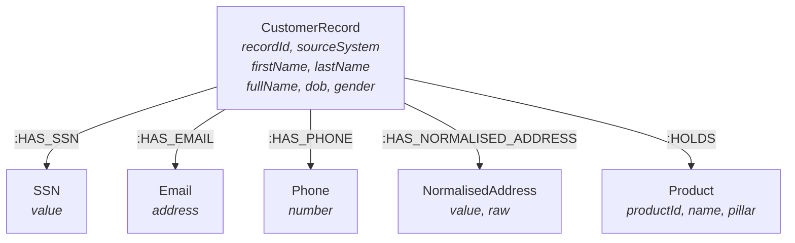

# Data Fragmentation and Customer 360 — Morgan

## The Problem

In large enterprises, customer data is fragmented across siloed product systems: retail banking, credit cards, mortgages, insurance, and wealth management each maintain their own customer records. The same individual may appear as multiple distinct records with slight variations in name, address, email, or phone. Without resolution, this leads to incomplete risk profiles, missed cross-sell opportunities, duplicated communications, and regulatory exposure during KYC reviews.

**Key challenge:** Traditional MDM approaches rely on deterministic matching (exact SSN or email match) which misses fuzzy matches like address typos, name variations ("Rob" vs "Robert"), or phone number reformatting. A graph-based approach connects all identifiers as first-class nodes, making shared PII traversable and enabling probabilistic resolution at scale.

---

## Prerequisites

To run these examples, you will need the following:

- A **Neo4j AuraDB** database instance. These examples will run on any tier, including the Free and Professional tiers. You can sign up for AuraDB [here](https://console.neo4j.io). Following the instructions will replace data in your instance, so back up first or create a fresh instance.
- **APOC plugin** — enabled by default on AuraDB. Required for `apoc.text.jaroWinklerDistance`, `apoc.text.levenshteinSimilarity`, and string normalisation.
- **GDS plugin** — available on AuraDB Professional+ or Neo4j Desktop. Required for WCC, Node Similarity, and Louvain in the advanced sections.
- (Optional) Cypher Workbench to experiment with the data model.
- (Optional) NeoDash or Neo4j Bloom for visual exploration of unified customer profiles.

---

## Solution — Six-Step Pipeline

```
  ┌──────────────────────────────────────────────────────────────────────┐
  │ Step 1        Step 2         Step 3       Step 4      Step 5        │
  │ NORMALISE  →  EXTERNALISE →  WCC       →  GOLDEN   →  FUZZY     →  │
  │ raw data      identifiers    clustering    record      matching     │
  │               as nodes                     creation    (residual)   │
  │                                                                     │
  │                                            Step 6                   │
  │                                            CUSTOMER 360 / UNIFIED   │
  │                                            VIEW                     │
  └──────────────────────────────────────────────────────────────────────┘
```

---

## Set up

Copy the full Cypher block below into your AuraDB Query console or Neo4j Browser. This creates a realistic enterprise dataset: **five product systems** (retail banking, credit cards, mortgage, insurance, wealth management) with overlapping customer records, name variations, address typos, and phone reformatting.

```cypher
// ──────────────────────────────────────
// Constraints
// ──────────────────────────────────────
CREATE CONSTRAINT cust_record_id IF NOT EXISTS
  FOR (r:CustomerRecord) REQUIRE r.recordId IS UNIQUE;
CREATE CONSTRAINT ssn_val IF NOT EXISTS
  FOR (s:SSN) REQUIRE s.value IS UNIQUE;
CREATE CONSTRAINT email_val IF NOT EXISTS
  FOR (e:Email) REQUIRE e.address IS UNIQUE;
CREATE CONSTRAINT phone_val IF NOT EXISTS
  FOR (p:Phone) REQUIRE p.number IS UNIQUE;
CREATE CONSTRAINT norm_addr_val IF NOT EXISTS
  FOR (a:NormalisedAddress) REQUIRE a.value IS UNIQUE;
CREATE CONSTRAINT product_id IF NOT EXISTS
  FOR (p:Product) REQUIRE p.productId IS UNIQUE;

CREATE INDEX record_system IF NOT EXISTS FOR (r:CustomerRecord) ON (r.sourceSystem);
CREATE INDEX record_fullname IF NOT EXISTS FOR (r:CustomerRecord) ON (r.fullName);

// ──────────────────────────────────────
// Products (across pillars)
// ──────────────────────────────────────
CREATE (prod1:Product {productId: "RETAIL_CHQ", name: "Everyday Cheque Account", pillar: "Retail"})
CREATE (prod2:Product {productId: "RETAIL_SAV", name: "SmartSaver Account", pillar: "Retail"})
CREATE (prod3:Product {productId: "CC_PLAT", name: "Platinum Credit Card", pillar: "Cards"})
CREATE (prod4:Product {productId: "CC_GOLD", name: "Gold Credit Card", pillar: "Cards"})
CREATE (prod5:Product {productId: "MORT_FIXED", name: "Fixed Rate Mortgage", pillar: "Mortgage"})
CREATE (prod6:Product {productId: "INS_HOME", name: "Home Insurance", pillar: "Insurance"})
CREATE (prod7:Product {productId: "INS_LIFE", name: "Life Cover", pillar: "Insurance"})
CREATE (prod8:Product {productId: "WM_ISA", name: "Stocks & Shares ISA", pillar: "Wealth"})
CREATE (prod9:Product {productId: "WM_PENSION", name: "Self-Invested Pension", pillar: "Wealth"})

// ──────────────────────────────────────
// Real Person 1: Robert James Thompson
// Appears in ALL 5 systems with name/format variations
// ──────────────────────────────────────
CREATE (r1:CustomerRecord {recordId: "RB-10001", sourceSystem: "RETAIL",
        firstName: "Robert", lastName: "Thompson", fullName: "Robert Thompson",
        dob: date("1980-04-12"), gender: "M"})
CREATE (r2:CustomerRecord {recordId: "CC-20001", sourceSystem: "CARDS",
        firstName: "Rob", lastName: "Thompson", fullName: "Rob Thompson",
        dob: date("1980-04-12"), gender: "M"})
CREATE (r3:CustomerRecord {recordId: "MG-30001", sourceSystem: "MORTGAGE",
        firstName: "Robert J.", lastName: "Thompson", fullName: "Robert J. Thompson",
        dob: date("1980-04-12"), gender: "M"})
CREATE (r4:CustomerRecord {recordId: "IN-40001", sourceSystem: "INSURANCE",
        firstName: "Robert", lastName: "Thompson", fullName: "Robert Thompson",
        dob: date("1980-04-12"), gender: "M"})
CREATE (r5:CustomerRecord {recordId: "WM-50001", sourceSystem: "WEALTH",
        firstName: "R.J.", lastName: "Thompson", fullName: "R.J. Thompson",
        dob: date("1980-04-12"), gender: "M"})

// Robert's identifiers
CREATE (ssn1:SSN {value: "AB123456C"})
CREATE (em1:Email {address: "rob.thompson@gmail.com"})
CREATE (em2:Email {address: "r.thompson@work.co.uk"})
CREATE (ph1:Phone {number: "+447700100100"})
CREATE (ph2:Phone {number: "+447700100101"})
CREATE (addr1:NormalisedAddress {value: "14 windsor terrace richmond tw9 2ab",
        raw: "14 Windsor Terrace, Richmond, TW9 2AB"})

CREATE (r1)-[:HAS_SSN]->(ssn1)<-[:HAS_SSN]-(r3)
CREATE (r1)-[:HAS_SSN]->(ssn1)<-[:HAS_SSN]-(r4)
CREATE (r1)-[:HAS_EMAIL]->(em1)<-[:HAS_EMAIL]-(r2)
CREATE (r3)-[:HAS_EMAIL]->(em2)<-[:HAS_EMAIL]-(r5)
CREATE (r1)-[:HAS_PHONE]->(ph1)<-[:HAS_PHONE]-(r2)
CREATE (r1)-[:HAS_PHONE]->(ph1)<-[:HAS_PHONE]-(r4)
CREATE (r3)-[:HAS_PHONE]->(ph2)
CREATE (r5)-[:HAS_PHONE]->(ph2)
CREATE (r1)-[:HAS_NORMALISED_ADDRESS]->(addr1)<-[:HAS_NORMALISED_ADDRESS]-(r3)
CREATE (r4)-[:HAS_NORMALISED_ADDRESS]->(addr1)

// Robert's products
CREATE (r1)-[:HOLDS {since: date("2015-03-01"), balance: 4520.00}]->(prod1)
CREATE (r1)-[:HOLDS {since: date("2018-06-15"), balance: 12300.00}]->(prod2)
CREATE (r2)-[:HOLDS {since: date("2019-11-20"), creditLimit: 15000, balance: 3200.00}]->(prod3)
CREATE (r3)-[:HOLDS {since: date("2016-09-01"), outstanding: 185000.00}]->(prod5)
CREATE (r4)-[:HOLDS {since: date("2016-10-01"), premium: 45.00}]->(prod6)
CREATE (r4)-[:HOLDS {since: date("2020-01-15"), premium: 32.00}]->(prod7)
CREATE (r5)-[:HOLDS {since: date("2021-04-01"), balance: 67000.00}]->(prod8)

// ──────────────────────────────────────
// Real Person 2: Amara Okafor-Williams
// Appears in 3 systems; hyphenated surname sometimes split
// ──────────────────────────────────────
CREATE (r6:CustomerRecord {recordId: "RB-10002", sourceSystem: "RETAIL",
        firstName: "Amara", lastName: "Okafor-Williams", fullName: "Amara Okafor-Williams",
        dob: date("1992-08-25"), gender: "F"})
CREATE (r7:CustomerRecord {recordId: "CC-20002", sourceSystem: "CARDS",
        firstName: "Amara", lastName: "Williams", fullName: "Amara Williams",
        dob: date("1992-08-25"), gender: "F"})
CREATE (r8:CustomerRecord {recordId: "IN-40002", sourceSystem: "INSURANCE",
        firstName: "Amara", lastName: "Okafor Williams", fullName: "Amara Okafor Williams",
        dob: date("1992-08-25"), gender: "F"})

// Amara's identifiers
CREATE (ssn2:SSN {value: "CD234567E"})
CREATE (em3:Email {address: "amara.ow@outlook.com"})
CREATE (ph3:Phone {number: "+447700200200"})
CREATE (addr2:NormalisedAddress {value: "88 cathedral road cardiff cf11 9ll",
        raw: "88 Cathedral Road, Cardiff CF11 9LL"})

CREATE (r6)-[:HAS_SSN]->(ssn2)<-[:HAS_SSN]-(r8)
CREATE (r6)-[:HAS_EMAIL]->(em3)<-[:HAS_EMAIL]-(r7)
CREATE (r6)-[:HAS_PHONE]->(ph3)<-[:HAS_PHONE]-(r7)
CREATE (r8)-[:HAS_PHONE]->(ph3)
CREATE (r6)-[:HAS_NORMALISED_ADDRESS]->(addr2)<-[:HAS_NORMALISED_ADDRESS]-(r8)

// Amara's products
CREATE (r6)-[:HOLDS {since: date("2020-02-14"), balance: 2890.00}]->(prod1)
CREATE (r7)-[:HOLDS {since: date("2021-07-01"), creditLimit: 8000, balance: 1500.00}]->(prod4)
CREATE (r8)-[:HOLDS {since: date("2022-03-01"), premium: 28.00}]->(prod7)

// ──────────────────────────────────────
// Real Person 3: Chen Wei Li
// Appears in 2 systems; name ordering differs (Eastern vs Western)
// ──────────────────────────────────────
CREATE (r9:CustomerRecord {recordId: "WM-50002", sourceSystem: "WEALTH",
        firstName: "Wei", lastName: "Li", fullName: "Wei Li",
        dob: date("1970-12-03"), gender: "M"})
CREATE (r10:CustomerRecord {recordId: "RB-10003", sourceSystem: "RETAIL",
         firstName: "Chen Wei", lastName: "Li", fullName: "Chen Wei Li",
         dob: date("1970-12-03"), gender: "M"})

// Chen Wei's identifiers
CREATE (ssn3:SSN {value: "EF345678G"})
CREATE (em4:Email {address: "chen.li@email.com"})
CREATE (ph4:Phone {number: "+447700300300"})
CREATE (addr3:NormalisedAddress {value: "5 pagoda gardens edinburgh eh1 2ng",
        raw: "5 Pagoda Gardens, Edinburgh EH1 2NG"})

CREATE (r9)-[:HAS_SSN]->(ssn3)<-[:HAS_SSN]-(r10)
CREATE (r9)-[:HAS_EMAIL]->(em4)<-[:HAS_EMAIL]-(r10)
CREATE (r9)-[:HAS_PHONE]->(ph4)
CREATE (r10)-[:HAS_PHONE]->(ph4)
CREATE (r9)-[:HAS_NORMALISED_ADDRESS]->(addr3)<-[:HAS_NORMALISED_ADDRESS]-(r10)

// Chen Wei's products
CREATE (r9)-[:HOLDS {since: date("2019-08-01"), balance: 340000.00}]->(prod9)
CREATE (r10)-[:HOLDS {since: date("2017-01-20"), balance: 15600.00}]->(prod1)

// ──────────────────────────────────────
// Real Person 4: Sophie Marie Laurent (singleton — only in insurance)
// ──────────────────────────────────────
CREATE (r11:CustomerRecord {recordId: "IN-40003", sourceSystem: "INSURANCE",
         firstName: "Sophie", lastName: "Laurent", fullName: "Sophie Laurent",
         dob: date("1985-06-18"), gender: "F"})

CREATE (ssn4:SSN {value: "GH456789I"})
CREATE (em5:Email {address: "sophie.l@free.fr"})
CREATE (ph5:Phone {number: "+447700400400"})
CREATE (addr4:NormalisedAddress {value: "22 brunswick square brighton bn1 2gj",
        raw: "22 Brunswick Square, Brighton BN1 2GJ"})

CREATE (r11)-[:HAS_SSN]->(ssn4)
CREATE (r11)-[:HAS_EMAIL]->(em5)
CREATE (r11)-[:HAS_PHONE]->(ph5)
CREATE (r11)-[:HAS_NORMALISED_ADDRESS]->(addr4)

CREATE (r11)-[:HOLDS {since: date("2023-05-01"), premium: 55.00}]->(prod6)
CREATE (r11)-[:HOLDS {since: date("2023-05-01"), premium: 38.00}]->(prod7)
```

---

## Data model



| Label | Key Properties | Purpose |
|-------|---------------|---------|
| CustomerRecord | recordId, sourceSystem, firstName, lastName, fullName, dob, gender | A single customer record from one product system |
| SSN | value | National insurance / tax identifier — high-confidence match |
| Email | address | Exact-match identifier |
| Phone | number | Normalised to international format |
| NormalisedAddress | value, raw | Pre-normalised for consistent matching; raw kept for display |
| Product | productId, name, pillar | Banking product held by the customer via that system's record |

---

## Step 1 — Normalisation

Before externalising identifiers, normalise the raw data so that equivalent values resolve to the same node.

```cypher
// Phone normalisation example — strip spaces, add country code
WITH "+44 7700 100 100" AS raw
WITH replace(replace(raw, ' ', ''), '-', '') AS cleaned
WITH CASE
       WHEN cleaned STARTS WITH '0' THEN '+44' + substring(cleaned, 1)
       ELSE cleaned
     END AS normalised
RETURN raw, normalised

// Address normalisation example — lowercase, expand abbreviations, strip punctuation
WITH "14 Windsor Terr., Richmond TW9 2AB" AS raw
WITH toLower(raw) AS step1
WITH apoc.text.replace(step1, '[.,]', '') AS step2
WITH apoc.text.replace(step2, '\\bterr\\b', 'terrace') AS step3
WITH apoc.text.replace(step3, '\\bst\\b', 'street') AS step4
WITH apoc.text.replace(step4, '\\brd\\b', 'road') AS step5
WITH apoc.text.replace(step5, '\\s+', ' ') AS normalised
RETURN raw, trim(normalised) AS normalised
```

In our demo data, normalisation is already applied — the `NormalisedAddress.value` field is pre-normalised, and phone numbers use international format. In production, run normalisation as a pre-processing step before creating identifier nodes.

---

## Step 2 — Externalise identifiers

The demo data already models identifiers as shared nodes (created in the setup script). In a real pipeline, you would transform tabular source data into this graph structure:

```cypher
// Example: converting a flat CSV row into the graph model
// (this is what you'd do for each source system's export)
LOAD CSV WITH HEADERS FROM 'file:///retail_customers.csv' AS row
MERGE (r:CustomerRecord {recordId: row.id})
SET r.sourceSystem = 'RETAIL',
    r.firstName = row.first_name,
    r.lastName = row.last_name,
    r.fullName = row.first_name + ' ' + row.last_name,
    r.dob = date(row.dob)

// Externalise SSN
FOREACH (_ IN CASE WHEN row.ssn IS NOT NULL THEN [1] ELSE [] END |
  MERGE (s:SSN {value: row.ssn})
  MERGE (r)-[:HAS_SSN]->(s)
)

// Externalise email (normalised to lowercase)
FOREACH (_ IN CASE WHEN row.email IS NOT NULL THEN [1] ELSE [] END |
  MERGE (e:Email {address: toLower(row.email)})
  MERGE (r)-[:HAS_EMAIL]->(e)
)

// Externalise phone (pre-normalised)
FOREACH (_ IN CASE WHEN row.phone IS NOT NULL THEN [1] ELSE [] END |
  MERGE (p:Phone {number: row.phone})
  MERGE (r)-[:HAS_PHONE]->(p)
)
```

The `MERGE` on identifier nodes is the key — if two records from different systems provide the same SSN, they automatically connect to the same `SSN` node. **The match is the structure, not a computation.**

---

## Step 3 — WCC (Weakly Connected Components)

Project records connected through 2+ shared identifier types and run WCC:

```cypher
// Drop previous projection if re-running
CALL gds.graph.drop('c360-er', false);

// Project with minimum 2 shared identifier types
CALL gds.graph.project('c360-er',
  'MATCH (r:CustomerRecord) RETURN id(r) AS id',
  'MATCH (a:CustomerRecord)-[:HAS_SSN|HAS_EMAIL|HAS_PHONE|HAS_NORMALISED_ADDRESS]->(idNode)
        <-[:HAS_SSN|HAS_EMAIL|HAS_PHONE|HAS_NORMALISED_ADDRESS]-(b:CustomerRecord)
   WHERE id(a) < id(b)
   WITH a, b, count(DISTINCT labels(idNode)[0]) AS idCount
   WHERE idCount >= 2
   RETURN id(a) AS source, id(b) AS target, idCount AS weight'
);

// Stream WCC results
CALL gds.wcc.stream('c360-er')
YIELD nodeId, componentId
WITH componentId AS entityId, collect(gds.util.asNode(nodeId)) AS members
RETURN entityId,
       size(members) AS recordCount,
       [m IN members | m.sourceSystem] AS systems,
       [m IN members | m.recordId + ': ' + m.fullName] AS records
ORDER BY recordCount DESC;

// Write entity IDs back
CALL gds.wcc.write(gds.graph.get('c360-er'), {writeProperty: 'entityId'})
YIELD nodePropertiesWritten, componentCount;
```

**Expected results:**

| entityId | recordCount | systems | records |
|----------|-------------|---------|---------|
| 0 | 5 | RETAIL, CARDS, MORTGAGE, INSURANCE, WEALTH | Robert Thompson (5 variants) |
| 1 | 3 | RETAIL, CARDS, INSURANCE | Amara Okafor-Williams (3 variants) |
| 2 | 2 | WEALTH, RETAIL | Chen Wei Li (2 variants) |
| 3 | 1 | INSURANCE | Sophie Laurent (singleton) |

Robert's 5 records across all product systems are correctly clustered. Amara's 3 records (including the one where the hyphen was dropped from her surname) are linked through shared email, phone, and SSN. Chen Wei Li's two records (with different name ordering) are linked. Sophie remains a singleton.

---

## Step 4 — Golden record

For each entity, select the best attribute value across all member records to construct a single canonical profile:

```cypher
MATCH (r:CustomerRecord)
WHERE r.entityId IS NOT NULL
WITH r.entityId AS entityId, collect(r) AS members
WITH entityId, members,
     // Longest full name is likely the most complete
     reduce(best = '', m IN members |
       CASE WHEN size(m.fullName) > size(best) THEN m.fullName ELSE best END
     ) AS goldenName,
     // Most common DOB (handles rare typos)
     head(
       apoc.coll.sortNodes(
         [m IN members | {dob: m.dob, count: size([x IN members WHERE x.dob = m.dob])}],
         '^count'
       )
     ).dob AS goldenDob,
     // All source systems
     [m IN members | m.sourceSystem] AS systems,
     size(members) AS recordCount

// Collect all identifiers for the entity
UNWIND members AS m
OPTIONAL MATCH (m)-[:HAS_SSN]->(s:SSN)
OPTIONAL MATCH (m)-[:HAS_EMAIL]->(e:Email)
OPTIONAL MATCH (m)-[:HAS_PHONE]->(p:Phone)
OPTIONAL MATCH (m)-[:HAS_NORMALISED_ADDRESS]->(a:NormalisedAddress)
WITH entityId, goldenName, goldenDob, systems, recordCount,
     collect(DISTINCT s.value) AS ssns,
     collect(DISTINCT e.address) AS emails,
     collect(DISTINCT p.number) AS phones,
     collect(DISTINCT a.raw) AS addresses

RETURN entityId,
       goldenName,
       goldenDob,
       systems,
       recordCount,
       ssns,
       emails,
       phones,
       addresses
ORDER BY recordCount DESC
```

**Expected output for Robert Thompson:**

| Field | Golden Value |
|-------|-------------|
| Name | Robert J. Thompson |
| DOB | 1980-04-12 |
| Systems | RETAIL, CARDS, MORTGAGE, INSURANCE, WEALTH |
| SSNs | [AB123456C] |
| Emails | [rob.thompson@gmail.com, r.thompson@work.co.uk] |
| Phones | [+447700100100, +447700100101] |
| Addresses | [14 Windsor Terrace, Richmond, TW9 2AB] |

---

## Step 5 — Fuzzy matching (residual)

WCC resolves records that share hard identifiers. For remaining unresolved records, apply fuzzy matching to catch name variations that share no identifiers:

```cypher
// Find record pairs in DIFFERENT WCC components with similar names + same DOB
MATCH (a:CustomerRecord), (b:CustomerRecord)
WHERE a.recordId < b.recordId
  AND a.entityId <> b.entityId
  AND a.dob = b.dob
WITH a, b,
     apoc.text.jaroWinklerDistance(toLower(a.fullName), toLower(b.fullName)) AS nameSim,
     apoc.text.jaroWinklerDistance(toLower(a.lastName), toLower(b.lastName)) AS lastSim
WHERE nameSim > 0.75 OR lastSim > 0.85
RETURN a.recordId AS id_1,
       a.fullName AS name_1,
       a.entityId AS entity_1,
       b.recordId AS id_2,
       b.fullName AS name_2,
       b.entityId AS entity_2,
       round(nameSim, 3) AS fullNameSim,
       round(lastSim, 3) AS lastNameSim
ORDER BY nameSim DESC
```

Records surfaced here go into a **manual review queue** — the analyst decides whether to merge the entities or mark them as distinct.

For automated handling, materialise fuzzy links and re-run WCC:

```cypher
// Create FUZZY_MATCH relationships for pairs above threshold
MATCH (a:CustomerRecord), (b:CustomerRecord)
WHERE a.recordId < b.recordId
  AND a.entityId <> b.entityId
  AND a.dob = b.dob
WITH a, b,
     apoc.text.jaroWinklerDistance(toLower(a.fullName), toLower(b.fullName)) AS nameSim
WHERE nameSim > 0.85
MERGE (a)-[f:FUZZY_MATCH]->(b)
SET f.similarity = round(nameSim, 3);
```

---

## Step 6 — Customer 360 / Unified View

The final step: aggregate everything into a single customer view that spans all product systems. This is the query a relationship manager, fraud analyst, or compliance officer would run.

```cypher
// Full Customer 360 for a specific entity
MATCH (r:CustomerRecord {entityId: 0})
WITH r.entityId AS entityId, collect(r) AS members

// Golden name
WITH entityId, members,
     reduce(best = '', m IN members |
       CASE WHEN size(m.fullName) > size(best) THEN m.fullName ELSE best END
     ) AS goldenName

// Aggregate identifiers
UNWIND members AS m
OPTIONAL MATCH (m)-[:HAS_SSN]->(s:SSN)
OPTIONAL MATCH (m)-[:HAS_EMAIL]->(e:Email)
OPTIONAL MATCH (m)-[:HAS_PHONE]->(p:Phone)
OPTIONAL MATCH (m)-[:HAS_NORMALISED_ADDRESS]->(a:NormalisedAddress)
WITH entityId, goldenName, m, members,
     collect(DISTINCT s.value) AS ssns,
     collect(DISTINCT e.address) AS emails,
     collect(DISTINCT p.number) AS phones,
     collect(DISTINCT a.raw) AS addresses

// Product portfolio across ALL systems
OPTIONAL MATCH (m)-[h:HOLDS]->(prod:Product)
WITH entityId, goldenName, ssns, emails, phones, addresses,
     collect(DISTINCT {
       product: prod.name,
       pillar: prod.pillar,
       since: h.since,
       balance: h.balance,
       premium: h.premium,
       outstanding: h.outstanding,
       creditLimit: h.creditLimit,
       sourceSystem: m.sourceSystem
     }) AS portfolio

RETURN entityId,
       goldenName AS customer,
       ssns, emails, phones, addresses,
       size(portfolio) AS totalProducts,
       [p IN portfolio | p.pillar] AS pillars,
       portfolio
```

**Result for Robert Thompson (entityId 0):**

```
Customer: Robert J. Thompson
SSNs: [AB123456C]
Emails: [rob.thompson@gmail.com, r.thompson@work.co.uk]
Phones: [+447700100100, +447700100101]
Total Products: 7
Pillars: [Retail, Retail, Cards, Mortgage, Insurance, Insurance, Wealth]

Portfolio:
  Retail  — Everyday Cheque Account    (balance: £4,520)
  Retail  — SmartSaver Account         (balance: £12,300)
  Cards   — Platinum Credit Card       (limit: £15,000, balance: £3,200)
  Mortgage — Fixed Rate Mortgage       (outstanding: £185,000)
  Insurance — Home Insurance           (premium: £45/mo)
  Insurance — Life Cover               (premium: £32/mo)
  Wealth  — Stocks & Shares ISA        (balance: £67,000)
```

**Without entity resolution**, a relationship manager would only see the products in whichever system they queried. With it, they see the **complete picture**: Robert is a high-value customer with £67K in investments, a £185K mortgage, and 7 products across 5 pillars. That's a very different conversation than "Robert has a cheque account."

### Customer 360 — summary view across all entities

```cypher
MATCH (r:CustomerRecord)
WHERE r.entityId IS NOT NULL
WITH r.entityId AS entityId, collect(r) AS members
WITH entityId, members,
     reduce(best = '', m IN members |
       CASE WHEN size(m.fullName) > size(best) THEN m.fullName ELSE best END
     ) AS goldenName,
     [m IN members | DISTINCT m.sourceSystem] AS systems
UNWIND members AS m
OPTIONAL MATCH (m)-[h:HOLDS]->(prod:Product)
WITH entityId, goldenName, systems,
     count(DISTINCT prod) AS productCount,
     collect(DISTINCT prod.pillar) AS pillars,
     sum(COALESCE(h.balance, 0)) + sum(COALESCE(h.outstanding, 0)) AS totalValue
RETURN entityId,
       goldenName AS customer,
       size(systems) AS systemsPresent,
       systems,
       productCount,
       pillars,
       round(totalValue) AS totalRelationshipValue
ORDER BY totalValue DESC
```

---

## Going further

### Cross-sell from the unified view

Once entities are resolved, cross-sell becomes trivial — find products that similar customers hold but this customer doesn't:

```cypher
// For entity 0 (Robert), find products held by customers in the same entity cluster size range
// but not held by Robert
MATCH (r:CustomerRecord {entityId: 0})-[:HOLDS]->(held:Product)
WITH collect(DISTINCT held.productId) AS heldIds

MATCH (other:CustomerRecord)-[:HOLDS]->(prod:Product)
WHERE other.entityId <> 0
  AND NOT prod.productId IN heldIds
WITH prod, count(DISTINCT other.entityId) AS otherEntitiesHolding
RETURN prod.name AS product,
       prod.pillar AS pillar,
       otherEntitiesHolding AS entitiesWithProduct
ORDER BY otherEntitiesHolding DESC
```

### Risk aggregation across systems

Aggregate exposure across all product systems for a single entity:

```cypher
MATCH (r:CustomerRecord)
WHERE r.entityId IS NOT NULL
WITH r.entityId AS entityId, collect(r) AS members
WITH entityId, members,
     reduce(best = '', m IN members |
       CASE WHEN size(m.fullName) > size(best) THEN m.fullName ELSE best END
     ) AS goldenName
UNWIND members AS m
OPTIONAL MATCH (m)-[h:HOLDS]->(prod:Product)
WITH entityId, goldenName,
     sum(COALESCE(h.balance, 0)) AS totalBalances,
     sum(COALESCE(h.outstanding, 0)) AS totalOutstanding,
     sum(COALESCE(h.creditLimit, 0)) AS totalCreditLimit,
     sum(COALESCE(h.premium, 0)) * 12 AS annualPremiums
RETURN entityId, goldenName,
       round(totalBalances) AS deposits,
       round(totalOutstanding) AS lending,
       round(totalCreditLimit) AS creditExposure,
       round(annualPremiums) AS annualInsurancePremiums,
       round(totalBalances + totalOutstanding + totalCreditLimit) AS totalExposure
ORDER BY totalExposure DESC
```

### KYC deduplication

During periodic KYC review, find customers who appear in multiple systems but haven't been resolved yet:

```cypher
// Records that share SSN but have different entity IDs (should have been merged)
MATCH (a:CustomerRecord)-[:HAS_SSN]->(s:SSN)<-[:HAS_SSN]-(b:CustomerRecord)
WHERE a.recordId < b.recordId
  AND a.entityId <> b.entityId
RETURN a.recordId AS record_1, a.fullName AS name_1, a.entityId AS entity_1,
       b.recordId AS record_2, b.fullName AS name_2, b.entityId AS entity_2,
       s.value AS shared_ssn
```

If this returns any rows, the WCC threshold may need adjustment, or these are new records that arrived after the last resolution run.

---

## Next steps

1. **Connect to real product systems.** Export customer records from each system (retail core banking, card management, mortgage origination, insurance policy admin, wealth platform) into CSVs matching the `CustomerRecord` structure.

2. **Automate normalisation.** Build a normalisation pipeline (Python, Spark, or APOC) that runs before graph loading. Phone numbers, addresses, and names should be standardised consistently across all sources.

3. **Build a NeoDash Customer 360 dashboard.** Page 1: entity search with golden record display. Page 2: full product portfolio with balances. Page 3: resolution audit trail (which records were merged, which identifiers linked them). Page 4: unresolved candidates for manual review.

4. **Integrate with CDC.** When a new customer record is created in any source system, trigger a pipeline that normalises identifiers, loads the record into the graph, and re-runs WCC for the affected component. Resolution becomes real-time, not batch.

5. **Add regulatory context.** Enrich the unified view with KYC status, PEP flags, and sanctions screening results from each source system. A single customer appearing as "KYC approved" in retail but "pending review" in insurance is a compliance gap that only entity resolution can surface.
