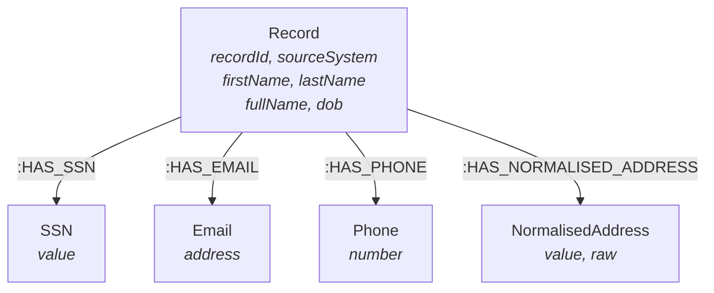

# Industry Agnostic Entity Resolution — Mounir & Jamie

## The Foundation: Externalised Identifiers + Weakly Connected Components

This section presents the **domain-neutral core technique** that underpins every use-case-specific ER implementation. The approach works identically whether the records represent bank customers, hospital patients, citizens, or IoT devices — because it operates on the *structure* of shared identifiers, not on the semantics of any particular domain.

The key insight: **stop thinking of identifiers as columns on a record. Model them as shared nodes in a graph.**

When two records share an email, a phone number, a national ID, or a normalised address, that shared identifier becomes a **node** connected to both records. Entity resolution then reduces to a standard graph problem: **find the connected components**.

```
Traditional (tabular)                     Graph (externalised identifiers)
─────────────────────                     ────────────────────────────────
┌──────────────────────┐                  Record_A ──→ SSN_123 ←── Record_B
│ id  name     email   │                  Record_A ──→ email_x ←── Record_C
│ 1   Sarah J  s@x.com │                  Record_B ──→ phone_1 ←── Record_C
│ 2   S Johnson s@y.com │
│ 3   Sarah J. s@x.com │                  → WCC finds {A, B, C} = one entity
└──────────────────────┘
```

In the tabular view, finding that records 1, 2, and 3 are the same person requires pairwise comparison of every column. In the graph, you just run WCC.

### Why this works across any industry

| Domain | "Record" | Shared identifiers |
|--------|----------|--------------------|
| Banking | Customer account | SSN, email, phone, address, device fingerprint |
| Healthcare | Patient record | NHS number, DOB+name, GP registration, address |
| Government | Citizen record | Tax ID, national ID, passport, address, employer |
| Telecoms | Subscriber | IMSI, IMEI, email, billing address |
| Insurance | Policyholder | Policy number, SSN, vehicle registration, address |
| E-commerce | User account | Email, device fingerprint, IP, shipping address |

The model is always the same: **Record → HAS_IDENTIFIER → Identifier ← HAS_IDENTIFIER ← Record**.

---

## Prerequisites

To run these examples, you will need the following:

- A **Neo4j AuraDB** database instance. These examples will run on any tier, including the Free and Professional tiers. You can sign up for AuraDB [here](https://console.neo4j.io). Following the instructions will replace data in your instance, so back up first or create a fresh instance.
- **APOC plugin** — enabled by default on AuraDB. Required for `apoc.text.jaroWinklerDistance`, `apoc.text.levenshteinSimilarity`, and normalisation functions.
- **GDS plugin** — available on AuraDB Professional+ or Neo4j Desktop. Required for WCC, Node Similarity, and community detection.
- (Optional) Cypher Workbench to experiment with the data model.
- (Optional) NeoDash or Neo4j Bloom for visual exploration of clusters.

---

## Set up

Copy the full Cypher block below into your AuraDB Query console or Neo4j Browser. This creates a realistic set of records from **three source systems** (CRM, billing, support) with deliberate overlaps — the same person appearing with slightly different names, different email addresses, and partial identifier coverage.

```cypher
// ──────────────────────────────────────
// Constraints
// ──────────────────────────────────────
CREATE CONSTRAINT record_id IF NOT EXISTS
  FOR (r:Record) REQUIRE r.recordId IS UNIQUE;
CREATE CONSTRAINT ssn_unique IF NOT EXISTS
  FOR (s:SSN) REQUIRE s.value IS UNIQUE;
CREATE CONSTRAINT email_unique IF NOT EXISTS
  FOR (e:Email) REQUIRE e.address IS UNIQUE;
CREATE CONSTRAINT phone_unique IF NOT EXISTS
  FOR (p:Phone) REQUIRE p.number IS UNIQUE;
CREATE CONSTRAINT normaddr_unique IF NOT EXISTS
  FOR (a:NormalisedAddress) REQUIRE a.value IS UNIQUE;

// Indexes
CREATE INDEX record_source IF NOT EXISTS FOR (r:Record) ON (r.sourceSystem);
CREATE INDEX record_name IF NOT EXISTS FOR (r:Record) ON (r.fullName);

// ──────────────────────────────────────
// Source System: CRM
// ──────────────────────────────────────

// Real person 1: Sarah Johnson (3 records across all 3 systems)
CREATE (r1:Record {recordId: "CRM-001", sourceSystem: "CRM", firstName: "Sarah",
        lastName: "Johnson", fullName: "Sarah Johnson", dob: date("1988-03-22")})

// Real person 2: Mohammed Ali Khan (2 records: CRM + billing)
CREATE (r2:Record {recordId: "CRM-002", sourceSystem: "CRM", firstName: "Mohammed",
        lastName: "Khan", fullName: "Mohammed Khan", dob: date("1975-11-08")})

// Real person 3: Emma van der Berg (2 records: CRM + support)
CREATE (r3:Record {recordId: "CRM-003", sourceSystem: "CRM", firstName: "Emma",
        lastName: "Van Der Berg", fullName: "Emma Van Der Berg", dob: date("1992-07-14")})

// Real person 4: James O'Brien (singleton — appears only in CRM)
CREATE (r4:Record {recordId: "CRM-004", sourceSystem: "CRM", firstName: "James",
        lastName: "O'Brien", fullName: "James O'Brien", dob: date("1965-01-30")})

// Real person 5: Priya Naidoo (3 records — complex case with minimal shared identifiers)
CREATE (r5:Record {recordId: "CRM-005", sourceSystem: "CRM", firstName: "Priya",
        lastName: "Naidoo", fullName: "Priya Naidoo", dob: date("1990-09-05")})

// ──────────────────────────────────────
// Source System: BILLING
// ──────────────────────────────────────

// Sarah Johnson — billing system has abbreviated first name
CREATE (r6:Record {recordId: "BIL-001", sourceSystem: "BILLING", firstName: "S.",
        lastName: "Johnson", fullName: "S. Johnson", dob: date("1988-03-22")})

// Mohammed Khan — billing system has middle initial
CREATE (r7:Record {recordId: "BIL-002", sourceSystem: "BILLING", firstName: "M.A.",
        lastName: "Khan", fullName: "M.A. Khan", dob: date("1975-11-08")})

// Priya Naidoo — billing system has married name
CREATE (r8:Record {recordId: "BIL-003", sourceSystem: "BILLING", firstName: "Priya",
        lastName: "Govender", fullName: "Priya Govender", dob: date("1990-09-05")})

// ──────────────────────────────────────
// Source System: SUPPORT
// ──────────────────────────────────────

// Sarah Johnson — support system has different name format
CREATE (r9:Record {recordId: "SUP-001", sourceSystem: "SUPPORT", firstName: "Sarah",
        lastName: "J.", fullName: "Sarah J.", dob: date("1988-03-22")})

// Emma van der Berg — support system has correct casing
CREATE (r10:Record {recordId: "SUP-002", sourceSystem: "SUPPORT", firstName: "Emma",
         lastName: "van der Berg", fullName: "Emma van der Berg", dob: date("1992-07-14")})

// Priya Naidoo — support system has maiden name + typo in DOB
CREATE (r11:Record {recordId: "SUP-003", sourceSystem: "SUPPORT", firstName: "Priya",
         lastName: "Naidoo", fullName: "Priya Naidoo", dob: date("1990-09-15")})

// ──────────────────────────────────────
// Externalised Identifiers — SSN
// ──────────────────────────────────────
CREATE (ssn1:SSN {value: "123-45-6789"})
CREATE (ssn2:SSN {value: "234-56-7890"})
CREATE (ssn3:SSN {value: "345-67-8901"})
CREATE (ssn4:SSN {value: "456-78-9012"})
CREATE (ssn5:SSN {value: "567-89-0123"})

// Sarah: CRM + billing share SSN
CREATE (r1)-[:HAS_SSN]->(ssn1)<-[:HAS_SSN]-(r6)
// Support record has no SSN (common in support systems)

// Mohammed: CRM + billing share SSN
CREATE (r2)-[:HAS_SSN]->(ssn2)<-[:HAS_SSN]-(r7)

// Emma: only CRM has SSN
CREATE (r3)-[:HAS_SSN]->(ssn3)

// James: singleton
CREATE (r4)-[:HAS_SSN]->(ssn4)

// Priya: CRM + support share SSN, billing record has no SSN
CREATE (r5)-[:HAS_SSN]->(ssn5)<-[:HAS_SSN]-(r11)

// ──────────────────────────────────────
// Externalised Identifiers — Email
// ──────────────────────────────────────
CREATE (em1:Email {address: "sarah.j@gmail.com"})
CREATE (em2:Email {address: "s.johnson@work.co.uk"})
CREATE (em3:Email {address: "m.khan@outlook.com"})
CREATE (em4:Email {address: "mkhan@bigcorp.com"})
CREATE (em5:Email {address: "emma.vdb@gmail.com"})
CREATE (em6:Email {address: "james.ob@email.com"})
CREATE (em7:Email {address: "priya.n@gmail.com"})
CREATE (em8:Email {address: "p.govender@work.co.za"})

// Sarah: CRM + support share personal email; billing has work email
CREATE (r1)-[:HAS_EMAIL]->(em1)<-[:HAS_EMAIL]-(r9)
CREATE (r6)-[:HAS_EMAIL]->(em2)

// Mohammed: different emails per system
CREATE (r2)-[:HAS_EMAIL]->(em3)
CREATE (r7)-[:HAS_EMAIL]->(em4)

// Emma: same email across both records
CREATE (r3)-[:HAS_EMAIL]->(em5)<-[:HAS_EMAIL]-(r10)

// James: singleton
CREATE (r4)-[:HAS_EMAIL]->(em6)

// Priya: CRM has personal email; billing has married-name work email
CREATE (r5)-[:HAS_EMAIL]->(em7)
CREATE (r8)-[:HAS_EMAIL]->(em8)

// ──────────────────────────────────────
// Externalised Identifiers — Phone
// ──────────────────────────────────────
CREATE (ph1:Phone {number: "07700100100"})
CREATE (ph2:Phone {number: "07700100101"})
CREATE (ph3:Phone {number: "07700200200"})
CREATE (ph4:Phone {number: "07700200201"})
CREATE (ph5:Phone {number: "07700300300"})
CREATE (ph6:Phone {number: "07700400400"})
CREATE (ph7:Phone {number: "07700500500"})

// Sarah: CRM + billing share mobile; support has landline
CREATE (r1)-[:HAS_PHONE]->(ph1)<-[:HAS_PHONE]-(r6)
CREATE (r9)-[:HAS_PHONE]->(ph2)

// Mohammed: CRM has mobile; billing has office line
CREATE (r2)-[:HAS_PHONE]->(ph3)
CREATE (r7)-[:HAS_PHONE]->(ph4)

// Emma: same phone both records
CREATE (r3)-[:HAS_PHONE]->(ph5)<-[:HAS_PHONE]-(r10)

// James: singleton
CREATE (r4)-[:HAS_PHONE]->(ph6)

// Priya: CRM + support share phone; billing has different number
CREATE (r5)-[:HAS_PHONE]->(ph7)<-[:HAS_PHONE]-(r11)
CREATE (r8)-[:HAS_PHONE]->(ph7)

// ──────────────────────────────────────
// Externalised Identifiers — Normalised Address
// ──────────────────────────────────────
// Addresses are pre-normalised (lowercase, abbreviations expanded, postcode standardised).
// In production, normalise with APOC or an external service before creating nodes.

CREATE (addr1:NormalisedAddress {value: "42 baker street flat 3 london nw1 6xe",
        raw: "42 Baker Street, Flat 3, London NW1 6XE"})
CREATE (addr2:NormalisedAddress {value: "15 deansgate suite 200 manchester m3 1sz",
        raw: "15 Deansgate, Suite 200, Manchester, M3 1SZ"})
CREATE (addr3:NormalisedAddress {value: "8 long street gardens cape town 8001",
        raw: "8 Long Street Gardens, Cape Town 8001"})
CREATE (addr4:NormalisedAddress {value: "22 victoria road leeds ls1 3ab",
        raw: "22 Victoria Road, Leeds LS1 3AB"})
CREATE (addr5:NormalisedAddress {value: "8 long street gardens cape town 8001",
        raw: "8 Long St Gardens, Cape Town, 8001"})

// Sarah: all 3 records share the same normalised address
CREATE (r1)-[:HAS_NORMALISED_ADDRESS]->(addr1)
CREATE (r6)-[:HAS_NORMALISED_ADDRESS]->(addr1)
CREATE (r9)-[:HAS_NORMALISED_ADDRESS]->(addr1)

// Mohammed: both records same address
CREATE (r2)-[:HAS_NORMALISED_ADDRESS]->(addr2)
CREATE (r7)-[:HAS_NORMALISED_ADDRESS]->(addr2)

// Emma: CRM has address; support has no address
CREATE (r3)-[:HAS_NORMALISED_ADDRESS]->(addr3)

// James: singleton
CREATE (r4)-[:HAS_NORMALISED_ADDRESS]->(addr4)

// Priya: CRM + support share address; billing has different address (moved after marriage)
CREATE (r5)-[:HAS_NORMALISED_ADDRESS]->(addr3)
CREATE (r11)-[:HAS_NORMALISED_ADDRESS]->(addr3)
// Note: addr3 is shared with Emma (they live at the same address — a flatmate scenario
//       that ER must handle: same address ≠ same person)
```

### What the demo data represents

| Real Person | Records | Shared Identifiers | Challenge |
|-------------|---------|-------------------|-----------|
| **Sarah Johnson** | CRM-001, BIL-001, SUP-001 | SSN (CRM↔BIL), email (CRM↔SUP), phone (CRM↔BIL), address (all 3) | Support record has no SSN; name abbreviated differently in each system |
| **Mohammed Khan** | CRM-002, BIL-002 | SSN (both), address (both) | No shared email or phone; billing uses middle initial |
| **Priya Naidoo** | CRM-005, BIL-003, SUP-003 | SSN (CRM↔SUP), phone (all 3) | Married name in billing ("Govender"); DOB typo in support; shares address with Emma |
| **Emma van der Berg** | CRM-003, SUP-002 | Email (both), phone (both) | Casing variation in surname; shares address with Priya |
| **James O'Brien** | CRM-004 | — (singleton) | No duplicates; should remain a single-record entity |

**Key traps in this data:**
- Priya and Emma share address `addr3` — WCC must not merge them into one entity
- Priya's billing record has a married surname and no SSN — connecting it requires the shared phone
- Sarah's support record has no SSN — connecting it requires the shared email

---

## Data model



| Label | Key Properties | Purpose |
|-------|---------------|---------|
| Record | recordId, sourceSystem, firstName, lastName, fullName, dob | A single record from any source system — the entity to be resolved |
| SSN | value | High-confidence exact-match identifier |
| Email | address | Exact-match identifier (shared personal email is strong; shared work domain is weaker) |
| Phone | number | Exact-match identifier |
| NormalisedAddress | value, raw | Normalised for consistent matching; `raw` preserved for display |

### Why externalise identifiers?

In a traditional table, identifiers are **columns** on a record:

```
| id  | name          | ssn           | email          | phone       |
| 1   | Sarah Johnson | 123-45-6789   | sarah.j@x.com  | 07700100100 |
| 2   | S. Johnson    | 123-45-6789   | s.j@work.com   | 07700100100 |
```

Finding that records 1 and 2 share an SSN requires scanning every row and comparing. With 10M records, that's 50 trillion comparisons.

In the graph, the shared SSN is a **single node** with two incoming edges:

```
Record_1 ──HAS_SSN──→ SSN{123-45-6789} ←──HAS_SSN── Record_2
```

No comparison needed. The relationship **is** the match. WCC simply follows the edges.

---

## Sample queries

### Pattern 1 — See the raw connections

Before running any algorithm, visualise how records connect through shared identifiers:

```cypher
MATCH (r:Record)-[rel:HAS_SSN|HAS_EMAIL|HAS_PHONE|HAS_NORMALISED_ADDRESS]->(id)
      <-[rel2:HAS_SSN|HAS_EMAIL|HAS_PHONE|HAS_NORMALISED_ADDRESS]-(r2:Record)
WHERE r.recordId < r2.recordId
RETURN r.recordId AS record_1,
       r.fullName AS name_1,
       r.sourceSystem AS system_1,
       r2.recordId AS record_2,
       r2.fullName AS name_2,
       r2.sourceSystem AS system_2,
       labels(id)[0] AS shared_identifier_type,
       CASE labels(id)[0]
         WHEN 'SSN' THEN id.value
         WHEN 'Email' THEN id.address
         WHEN 'Phone' THEN id.number
         WHEN 'NormalisedAddress' THEN id.value
       END AS shared_value
ORDER BY record_1, record_2
```

**Expected results:** You'll see all the pairwise connections — Sarah's 3 records linked through SSN, email, phone, and address; Mohammed's 2 records linked through SSN and address; etc. Crucially, you'll also see Emma and Priya linked through the shared address — a **false link** that WCC with a minimum identifier threshold will handle.

### Pattern 2 — Weighted connections (identifier count filter)

Not all shared identifiers carry equal weight. A shared address alone is weak (flatmates). Require **2+ distinct identifier types** to establish a link:

```cypher
MATCH (a:Record)-[:HAS_SSN|HAS_EMAIL|HAS_PHONE|HAS_NORMALISED_ADDRESS]->(idNode)
      <-[:HAS_SSN|HAS_EMAIL|HAS_PHONE|HAS_NORMALISED_ADDRESS]-(b:Record)
WHERE a.recordId < b.recordId
WITH a, b, count(DISTINCT labels(idNode)[0]) AS sharedIdTypes
WHERE sharedIdTypes >= 2
RETURN a.recordId AS record_1,
       a.fullName AS name_1,
       b.recordId AS record_2,
       b.fullName AS name_2,
       sharedIdTypes
ORDER BY sharedIdTypes DESC
```

**Why this matters:** With a threshold of 2, Emma (CRM-003) and Priya (CRM-005) are no longer linked — they only share an address. But Sarah's CRM and billing records are linked (SSN + phone + address = 3 shared types). This is the **blocking** step — it controls the false positive rate.

### Pattern 3 — WCC: Assign entity IDs

This is the core algorithm. Project the filtered graph into GDS and run Weakly Connected Components:

```cypher
// Step 1 — Drop previous projection if re-running
CALL gds.graph.drop('erGraph', false);

// Step 2 — Project: Records connected through 2+ shared identifier types
CALL gds.graph.project('erGraph',
  'MATCH (r:Record) RETURN id(r) AS id',
  'MATCH (a:Record)-[:HAS_SSN|HAS_EMAIL|HAS_PHONE|HAS_NORMALISED_ADDRESS]->(idNode)
        <-[:HAS_SSN|HAS_EMAIL|HAS_PHONE|HAS_NORMALISED_ADDRESS]-(b:Record)
   WHERE id(a) < id(b)
   WITH a, b, count(DISTINCT labels(idNode)[0]) AS idCount
   WHERE idCount >= 2
   RETURN id(a) AS source, id(b) AS target, idCount AS weight'
);

// Step 3 — Run WCC and stream results
CALL gds.wcc.stream('erGraph')
YIELD nodeId, componentId
WITH componentId AS entityId,
     collect(gds.util.asNode(nodeId)) AS members
RETURN entityId,
       size(members) AS recordCount,
       [m IN members | m.recordId + ' (' + m.sourceSystem + '): ' + m.fullName] AS records
ORDER BY recordCount DESC;
```

**Expected results:**

| entityId | recordCount | records |
|----------|-------------|---------|
| 0 | 3 | CRM-001 (CRM): Sarah Johnson, BIL-001 (BILLING): S. Johnson, SUP-001 (SUPPORT): Sarah J. |
| 1 | 3 | CRM-005 (CRM): Priya Naidoo, BIL-003 (BILLING): Priya Govender, SUP-003 (SUPPORT): Priya Naidoo |
| 2 | 2 | CRM-002 (CRM): Mohammed Khan, BIL-002 (BILLING): M.A. Khan |
| 3 | 2 | CRM-003 (CRM): Emma Van Der Berg, SUP-002 (SUPPORT): Emma van der Berg |
| 4 | 1 | CRM-004 (CRM): James O'Brien |

Sarah resolves to 3 records. Priya resolves to 3 (including the married-name billing record, connected via shared phone). Mohammed resolves to 2. Emma resolves to 2. James stays as a singleton. **Emma and Priya are correctly kept separate** despite sharing an address — because the 2-identifier threshold filtered out that single shared link.

### Pattern 4 — Write entity IDs back to records

Persist the resolution for downstream use:

```cypher
// Write entity_id to every Record node
CALL gds.wcc.write(
  gds.graph.get('erGraph'),
  {writeProperty: 'entityId'}
)
YIELD nodePropertiesWritten, componentCount;

// Verify
MATCH (r:Record)
RETURN r.entityId AS entityId,
       count(r) AS records,
       collect(r.recordId) AS recordIds
ORDER BY records DESC;
```

### Pattern 5 — Build a golden record per entity

Once entity IDs are assigned, create a single "golden" view by selecting the best value for each attribute across the cluster:

```cypher
MATCH (r:Record)
WITH r.entityId AS entityId, collect(r) AS members
WHERE size(members) > 1
WITH entityId, members,
     // Prefer the longest (most complete) name
     reduce(best = '', m IN members |
       CASE WHEN size(m.fullName) > size(best) THEN m.fullName ELSE best END
     ) AS goldenName,
     // Prefer the earliest DOB (least likely to be a typo)
     reduce(best = date('9999-12-31'), m IN members |
       CASE WHEN m.dob < best THEN m.dob ELSE best END
     ) AS goldenDob,
     [m IN members | m.sourceSystem] AS systems
RETURN entityId,
       goldenName,
       goldenDob,
       systems,
       size(members) AS recordsMerged
ORDER BY recordsMerged DESC
```

### Pattern 6 — Fuzzy name matching to catch remaining misses

WCC resolves records that share hard identifiers. But some duplicates share **no** exact identifiers — only fuzzy name similarity and DOB. Use APOC to find them:

```cypher
// Find record pairs in DIFFERENT WCC components that have similar names + same DOB
MATCH (a:Record), (b:Record)
WHERE a.recordId < b.recordId
  AND a.entityId <> b.entityId           // not already resolved by WCC
  AND a.dob = b.dob                      // blocking on DOB
WITH a, b,
     apoc.text.jaroWinklerDistance(
       toLower(a.fullName), toLower(b.fullName)
     ) AS nameSim
WHERE nameSim > 0.75
RETURN a.recordId AS id_1,
       a.fullName AS name_1,
       a.entityId AS entity_1,
       b.recordId AS id_2,
       b.fullName AS name_2,
       b.entityId AS entity_2,
       round(nameSim, 3) AS name_similarity
ORDER BY nameSim DESC
```

This catches records that WCC missed because they didn't share 2+ hard identifiers but are clearly the same person based on fuzzy name + DOB. These are candidates for a **manual review queue** — or for lowering the WCC identifier threshold in a second pass.

---

## Going further

### Tuning the identifier threshold

The `idCount >= 2` threshold in Pattern 3 is the key dial for precision vs recall:

| Threshold | Behaviour | When to use |
|-----------|-----------|-------------|
| `>= 1` | Any single shared identifier links records | High recall, higher false positives. Use when identifiers are highly reliable (e.g. SSN, passport) |
| `>= 2` | Two different identifier types required | Balanced. The recommended starting point for most domains |
| `>= 3` | Three shared identifier types required | High precision, lower recall. Use in safety-critical domains (healthcare) where false merges are dangerous |

You can also **weight** identifiers differently:

```cypher
// Weighted projection: SSN counts as 3, email as 2, phone as 2, address as 1
CALL gds.graph.project('erGraph-weighted',
  'MATCH (r:Record) RETURN id(r) AS id',
  'MATCH (a:Record)-[rel]->(idNode)<-[rel2]-(b:Record)
   WHERE id(a) < id(b)
     AND type(rel) IN ["HAS_SSN","HAS_EMAIL","HAS_PHONE","HAS_NORMALISED_ADDRESS"]
     AND type(rel2) IN ["HAS_SSN","HAS_EMAIL","HAS_PHONE","HAS_NORMALISED_ADDRESS"]
   WITH a, b,
        sum(CASE labels(idNode)[0]
          WHEN "SSN" THEN 3
          WHEN "Email" THEN 2
          WHEN "Phone" THEN 2
          WHEN "NormalisedAddress" THEN 1
          ELSE 0
        END) AS weightedScore
   WHERE weightedScore >= 3
   RETURN id(a) AS source, id(b) AS target, weightedScore AS weight'
);
```

### GDS: Refine with Node Similarity (Jaccard)

For large datasets where WCC produces oversized clusters (hundreds of records in one component due to shared corporate phone numbers or office addresses), use Jaccard similarity to split them:

```cypher
CALL gds.graph.project('er-similarity',
  ['Record', 'SSN', 'Email', 'Phone', 'NormalisedAddress'],
  ['HAS_SSN', 'HAS_EMAIL', 'HAS_PHONE', 'HAS_NORMALISED_ADDRESS']
);

CALL gds.nodeSimilarity.stream('er-similarity', {
  topK: 5,
  similarityCutoff: 0.4
})
YIELD node1, node2, similarity
WITH gds.util.asNode(node1) AS r1, gds.util.asNode(node2) AS r2, similarity
WHERE r1:Record AND r2:Record
RETURN r1.recordId AS record_1,
       r1.fullName AS name_1,
       r2.recordId AS record_2,
       r2.fullName AS name_2,
       round(similarity, 3) AS jaccard
ORDER BY jaccard DESC;

CALL gds.graph.drop('er-similarity');
```

Records with high Jaccard similarity share many of the same identifier nodes — strong evidence they are the same person. Records within a WCC component that have **low** Jaccard similarity may be false positives (e.g. connected only through a shared corporate address).

### GDS: Louvain for sub-community detection

When WCC components become very large, use Louvain to find natural sub-clusters:

```cypher
CALL gds.louvain.stream('erGraph', {
  relationshipWeightProperty: 'weight'
})
YIELD nodeId, communityId
WITH communityId, collect(gds.util.asNode(nodeId)) AS members
WHERE size(members) > 1
RETURN communityId,
       size(members) AS recordCount,
       [m IN members | m.recordId + ': ' + m.fullName] AS records
ORDER BY recordCount DESC;
```

### Address normalisation with APOC

In production, normalise addresses before creating `NormalisedAddress` nodes:

```cypher
// Example normalisation pipeline
WITH "42 Baker St., Flat 3, London NW1 6XE" AS raw
WITH raw,
     apoc.text.replace(toLower(raw), '[.,]', '') AS step1,
     apoc.text.replace(
       apoc.text.replace(toLower(raw), '[.,]', ''),
       '\\bst\\b', 'street'
     ) AS step2
WITH raw, apoc.text.replace(step2, '\\s+', ' ') AS normalised
RETURN raw, trim(normalised) AS normalised
```

For production-grade normalisation, consider:
- Expand abbreviations (St → Street, Rd → Road, Ave → Avenue, Ste → Suite)
- Remove punctuation and extra whitespace
- Standardise postcode format (remove spaces, uppercase)
- Use an external geocoding API (Google, HERE, Loqate) to canonicalise to a standard form

### Parallel processing at scale

For millions of records, parallelise the identifier comparison using `apoc.periodic.iterate`:

```cypher
CALL apoc.periodic.iterate(
  "MATCH (a:Record) WHERE a.entityId IS NULL RETURN a",
  "WITH a
   MATCH (a)-[:HAS_SSN|HAS_EMAIL|HAS_PHONE|HAS_NORMALISED_ADDRESS]->(idNode)
         <-[:HAS_SSN|HAS_EMAIL|HAS_PHONE|HAS_NORMALISED_ADDRESS]-(b:Record)
   WHERE id(a) < id(b)
   WITH a, b, count(DISTINCT labels(idNode)[0]) AS sharedTypes
   WHERE sharedTypes >= 2
   MERGE (a)-[:LINKED {sharedTypes: sharedTypes}]->(b)",
  {batchSize: 1000, parallel: true, concurrency: 4}
)
YIELD total, batches, failedBatches;
```

---

## The full ER pipeline — summary

```
Step 1: INGEST          Load records from each source system as :Record nodes
                        Each record keeps its original attributes (name, DOB, etc.)

Step 2: NORMALISE       Clean and standardise identifiers
                        Addresses: lowercase, expand abbreviations, remove punctuation
                        Phones: strip formatting, add country code
                        Names: (keep original — normalise only for comparison)

Step 3: EXTERNALISE     Create identifier nodes (SSN, Email, Phone, NormalisedAddress)
                        with UNIQUE constraints. Records connect to them via :HAS_* edges.
                        Shared identifiers become shared nodes — the match is the structure.

Step 4: FILTER          Project into GDS with a minimum shared-identifier-type threshold.
                        This is the blocking step — it controls false positive rate.
                        Threshold >= 2 is the recommended starting point.

Step 5: CLUSTER (WCC)   Run Weakly Connected Components.
                        Each component = one real-world entity.
                        Write entity_id back to Record nodes.

Step 6: REFINE          Fuzzy name matching (APOC) for records that didn't share
                        hard identifiers. Node Similarity (Jaccard) to split
                        oversized clusters. Louvain for sub-community detection.

Step 7: GOLDEN RECORD   For each entity_id, select the best value per attribute
                        across all member records. Create a unified view.

Step 8: MONITOR         Use Change Data Capture or periodic re-runs to resolve
                        new records as they arrive.
```

---

## Next steps

1. **Load your own data** into the same graph model. Export records from each source system into CSVs matching the `Record` structure. Create identifier nodes from the identifier columns.

2. **Add more identifier types** — national insurance numbers, device fingerprints, tax IDs, loyalty card numbers — each as a new node label with a unique constraint and `:HAS_*` relationship. The model extends naturally.

3. **Tune the threshold** for your domain. Start with `>= 2`, measure precision/recall against a labelled sample, and adjust. Safety-critical domains (healthcare) should start higher.

4. **Build a review workflow.** Create a NeoDash dashboard where analysts see WCC clusters with their confidence metrics (number of shared identifier types, name similarity, etc.) and can approve, reject, or split merges.

5. **Automate with CDC.** Use Change Data Capture to trigger ER checks whenever a new record is created — resolve in real time rather than batch.

6. **Feed into domain-specific pipelines.** The entity IDs produced here become the input for use-case-specific analysis: UBO resolution (FSI), patient matching (healthcare), citizen identity (government), or fraud detection (cross-domain).
