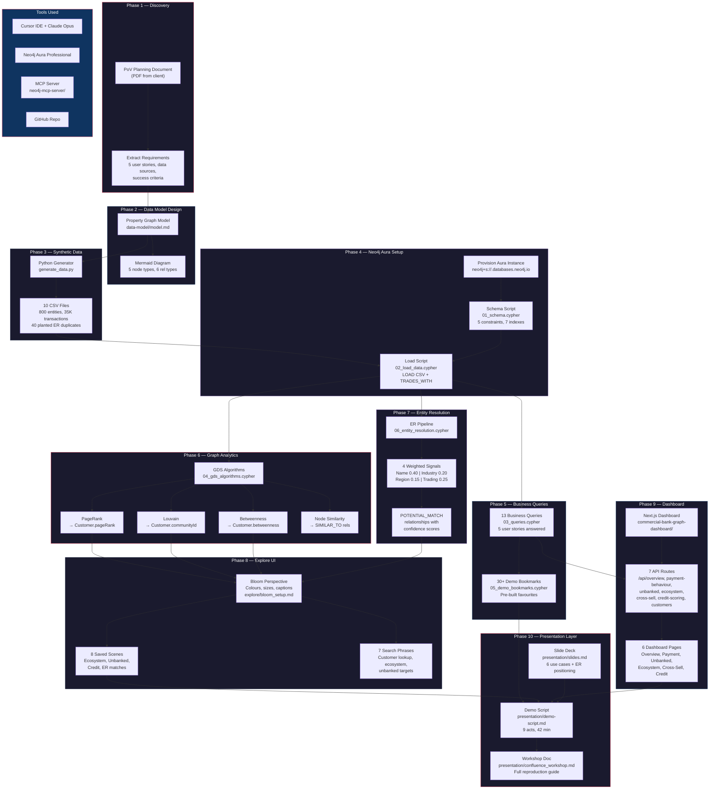
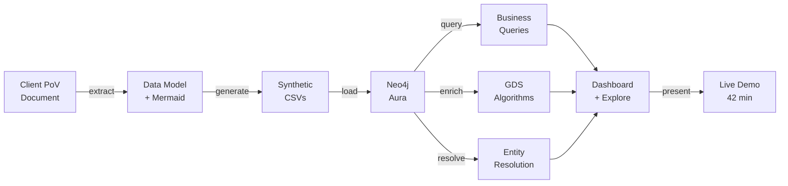
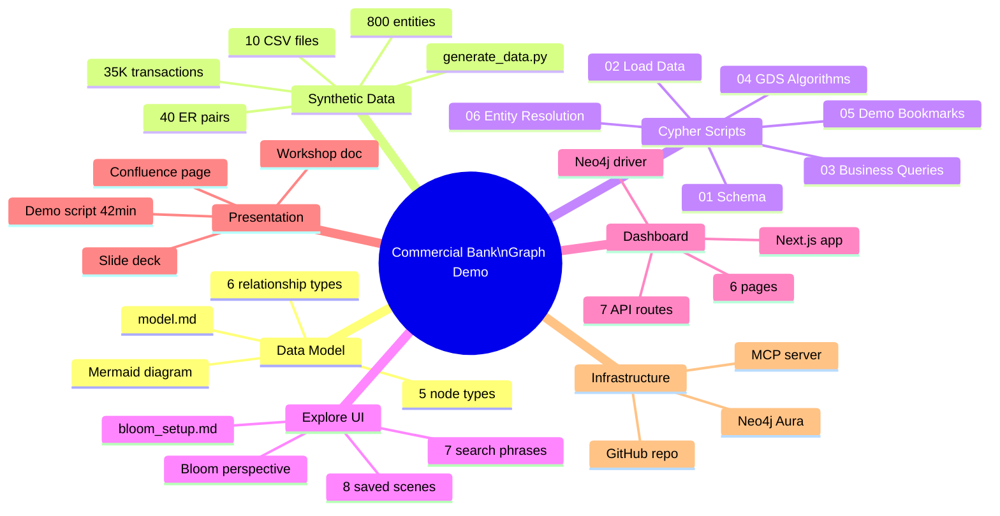

# End-to-End Workflow: PoV Document → Live Demo

```mermaid
flowchart TD
    subgraph phase1 [Phase 1 — Discovery]
        POV["PoV Planning Document\n(PDF from client)"]
        EXTRACT["Extract Requirements\n5 user stories, data sources,\nsuccess criteria"]
        POV --> EXTRACT
    end

    subgraph phase2 [Phase 2 — Data Model Design]
        MODEL["Property Graph Model\ndata-model/model.md"]
        MERMAID["Mermaid Diagram\n5 node types, 6 rel types"]
        EXTRACT --> MODEL
        MODEL --> MERMAID
    end

    subgraph phase3 [Phase 3 — Synthetic Data]
        GENERATOR["Python Generator\ngenerate_data.py"]
        CSV["10 CSV Files\n800 entities, 35K transactions\n40 planted ER duplicates"]
        MODEL --> GENERATOR
        GENERATOR --> CSV
    end

    subgraph phase4 [Phase 4 — Neo4j Aura Setup]
        AURA["Provision Aura Instance\nneo4j+s://<your-instance>.databases.neo4j.io"]
        SCHEMA["Schema Script\n01_schema.cypher\n5 constraints, 7 indexes"]
        LOAD["Load Script\n02_load_data.cypher\nLOAD CSV + TRADES_WITH"]
        CSV --> LOAD
        AURA --> SCHEMA
        SCHEMA --> LOAD
    end

    subgraph phase5 [Phase 5 — Business Queries]
        QUERIES["13 Business Queries\n03_queries.cypher\n5 user stories answered"]
        BOOKMARKS["30+ Demo Bookmarks\n05_demo_bookmarks.cypher\nPre-built favourites"]
        LOAD --> QUERIES
        QUERIES --> BOOKMARKS
    end

    subgraph phase6 [Phase 6 — Graph Analytics]
        GDS["GDS Algorithms\n04_gds_algorithms.cypher"]
        PR["PageRank\n→ Customer.pageRank"]
        LV["Louvain\n→ Customer.communityId"]
        BC["Betweenness\n→ Customer.betweenness"]
        NS["Node Similarity\n→ SIMILAR_TO rels"]
        LOAD --> GDS
        GDS --> PR
        GDS --> LV
        GDS --> BC
        GDS --> NS
    end

    subgraph phase7 [Phase 7 — Entity Resolution]
        ER["ER Pipeline\n06_entity_resolution.cypher"]
        SIGNALS["4 Weighted Signals\nName 0.40 | Industry 0.20\nRegion 0.15 | Trading 0.25"]
        MATCHES["POTENTIAL_MATCH\nrelationships with\nconfidence scores"]
        LOAD --> ER
        ER --> SIGNALS
        SIGNALS --> MATCHES
    end

    subgraph phase8 [Phase 8 — Explore UI]
        PERSPECTIVE["Bloom Perspective\nColours, sizes, captions\nexplore/bloom_setup.md"]
        SCENES["8 Saved Scenes\nEcosystem, Unbanked,\nCredit, ER matches"]
        SEARCH["7 Search Phrases\nCustomer lookup, ecosystem,\nunbanked targets"]
        PR --> PERSPECTIVE
        LV --> PERSPECTIVE
        BC --> PERSPECTIVE
        MATCHES --> PERSPECTIVE
        PERSPECTIVE --> SCENES
        PERSPECTIVE --> SEARCH
    end

    subgraph phase9 [Phase 9 — Dashboard]
        NEXTJS["Next.js Dashboard\ncommercial-bank-graph-dashboard/"]
        API["7 API Routes\n/api/overview, payment-behaviour,\nunbanked, ecosystem,\ncross-sell, credit-scoring, customers"]
        PAGES["6 Dashboard Pages\nOverview, Payment, Unbanked,\nEcosystem, Cross-Sell, Credit"]
        QUERIES --> API
        NEXTJS --> API
        API --> PAGES
    end

    subgraph phase10 [Phase 10 — Presentation Layer]
        SLIDES["Slide Deck\npresentation/slides.md\n6 use cases + ER positioning"]
        SCRIPT["Demo Script\npresentation/demo-script.md\n9 acts, 42 min"]
        CONFLUENCE["Workshop Doc\npresentation/confluence_workshop.md\nFull reproduction guide"]
        BOOKMARKS --> SCRIPT
        SCENES --> SCRIPT
        PAGES --> SCRIPT
        SLIDES --> SCRIPT
        SCRIPT --> CONFLUENCE
    end

    subgraph tools [Tools Used]
        CURSOR["Cursor IDE + Claude Opus"]
        NEO4J["Neo4j Aura Professional"]
        MCP["MCP Server\nneo4j-mcp-server/"]
        GITHUB["GitHub Repo"]
    end

    style phase1 fill:#1a1a2e,stroke:#e94560,color:#fff
    style phase2 fill:#1a1a2e,stroke:#0f3460,color:#fff
    style phase3 fill:#1a1a2e,stroke:#16213e,color:#fff
    style phase4 fill:#1a1a2e,stroke:#533483,color:#fff
    style phase5 fill:#1a1a2e,stroke:#0f3460,color:#fff
    style phase6 fill:#1a1a2e,stroke:#e94560,color:#fff
    style phase7 fill:#1a1a2e,stroke:#533483,color:#fff
    style phase8 fill:#1a1a2e,stroke:#16213e,color:#fff
    style phase9 fill:#1a1a2e,stroke:#0f3460,color:#fff
    style phase10 fill:#1a1a2e,stroke:#e94560,color:#fff
    style tools fill:#0f3460,stroke:#e94560,color:#fff
```

## Workflow Summary

```mermaid
flowchart LR
    A["Client PoV\nDocument"] -->|extract| B["Data Model\n+ Mermaid"]
    B -->|generate| C["Synthetic\nCSVs"]
    C -->|load| D["Neo4j\nAura"]
    D -->|query| E["Business\nQueries"]
    D -->|enrich| F["GDS\nAlgorithms"]
    D -->|resolve| G["Entity\nResolution"]
    E --> H["Dashboard\n+ Explore"]
    F --> H
    G --> H
    H -->|present| I["Live Demo\n42 min"]
```

## Timeline

```mermaid
gantt
    title Build Timeline — PoV to Demo
    dateFormat  HH:mm
    axisFormat  %H:%M

    section Discovery
    Read PoV document & extract requirements    :done, d1, 00:00, 15m

    section Data Model
    Design property graph model                 :done, d2, after d1, 20m
    Create Mermaid diagram                      :done, d3, after d2, 10m

    section Synthetic Data
    Write Python generator                      :done, d4, after d3, 30m
    Generate 10 CSV files                       :done, d5, after d4, 5m

    section Neo4j Setup
    Provision Aura instance                     :done, d6, after d5, 10m
    Schema constraints & indexes                :done, d7, after d6, 10m
    Load CSV data + TRADES_WITH                 :done, d8, after d7, 15m

    section Queries & Analytics
    Write 13 business queries                   :done, d9, after d8, 30m
    Run GDS algorithms                          :done, d10, after d9, 15m
    Build ER pipeline                           :done, d11, after d10, 30m
    Create 30+ demo bookmarks                   :done, d12, after d11, 20m

    section Explore UI
    Configure perspective & styles              :done, d13, after d12, 20m
    Build 8 saved scenes                        :done, d14, after d13, 20m

    section Dashboard
    Scaffold Next.js app                        :done, d15, after d8, 30m
    Build 7 API routes                          :done, d16, after d15, 30m
    Build 6 dashboard pages                     :done, d17, after d16, 45m

    section Presentation
    Write slide deck                            :done, d18, after d17, 20m
    Write demo script                           :done, d19, after d18, 15m
    Write workshop doc                          :done, d20, after d19, 15m
```

## Deliverables Produced

```mermaid
mindmap
    root((Commercial Bank\nGraph Demo))
        Data Model
            model.md
            Mermaid diagram
            5 node types
            6 relationship types
        Synthetic Data
            generate_data.py
            10 CSV files
            800 entities
            35K transactions
            40 ER pairs
        Cypher Scripts
            01 Schema
            02 Load Data
            03 Business Queries
            04 GDS Algorithms
            05 Demo Bookmarks
            06 Entity Resolution
        Explore UI
            Bloom perspective
            8 saved scenes
            7 search phrases
            bloom_setup.md
        Dashboard
            Next.js app
            6 pages
            7 API routes
            Neo4j driver
        Presentation
            Slide deck
            Demo script 42min
            Workshop doc
            Confluence page
        Infrastructure
            Neo4j Aura
            MCP server
            GitHub repo
```
